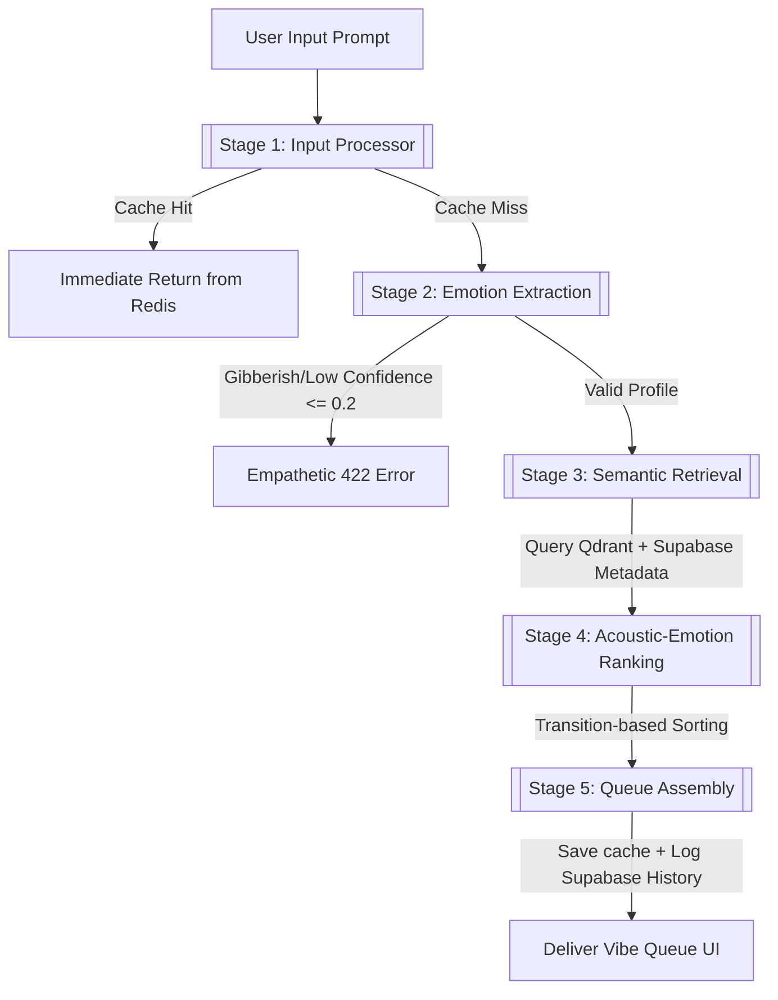

# Vibe-Checker — Real-Time Emotional Context Discovery Layer

Vibe-Checker is an AI-powered emotional intent understanding layer designed to plug into music platforms like Spotify. It translates free-form natural language emotional prompts (e.g., *"feeling low, need something that lifts me slowly"* or *"melancholy but hopeful"*) into personalized, emotionally coherent music discovery queues instantly — before playback begins.

---

## 🛠️ Technology Stack
- **Frontend:** Next.js (React) + TypeScript + TailwindCSS (Vite/App Router)
- **Backend:** FastAPI + AsyncIO (Python 3.11/3.14)
- **LLM Provider:** Groq Cloud (Llama-3.1-8B-Instant)
- **Embeddings:** HuggingFace ONNX-powered `fastembed` (`BAAI/bge-small-en-v1.5`)
- **Vector Database:** Qdrant Cloud (Free Tier)
- **Relational DB / Auth:** Supabase (PostgreSQL + Google OAuth)
- **Cache Layer:** Upstash Redis (Serverless Cache)

---

## 🧬 End-to-End Pipeline Workflow

The core search and recommendation logic runs through a **5-stage sequential AI pipeline** coordinated by the [PipelineOrchestrator](file:///c:/Users/HP/OneDrive/Desktop/shiv1/programming%20project/Git_hub%20project/Vibe-Checker%E2%80%94%20Real-Time%20Emotional%20Context%20Discovery%20Layer/backend/app/pipeline/orchestrator.py):



1. **Stage 1 — [InputProcessor](file:///c:/Users/HP/OneDrive/Desktop/shiv1/programming%20project/Git_hub%20project/Vibe-Checker%E2%80%94%20Real-Time%20Emotional%20Context%20Discovery%20Layer/backend/app/pipeline/input_processor.py):** Sanitizes prompt, validates length (≤ 500 chars), checks Redis for cached queues, and checks user rate limits.
2. **Stage 2 — [EmotionExtractor](file:///c:/Users/HP/OneDrive/Desktop/shiv1/programming%20project/Git_hub%20project/Vibe-Checker%E2%80%94%20Real-Time%20Emotional%20Context%20Discovery%20Layer/backend/app/pipeline/emotion_extractor.py):** Sends the prompt to Groq. Generates structured emotional variables: primary/secondary emotions, valence (mood), energy, tempo ranges, and transitions. Intercepts inputs with confidence scores `≤ 0.2` (e.g., gibberish like `"asdfjkl"`) and raises a validation error.
3. **Stage 3 — [SemanticRetriever](file:///c:/Users/HP/OneDrive/Desktop/shiv1/programming%20project/Git_hub%20project/Vibe-Checker%E2%80%94%20Real-Time%20Emotional%20Context%20Discovery%20Layer/backend/app/pipeline/semantic_retriever.py):** Generates a dense vector representation using `fastembed` and performs similarity search on Qdrant Cloud to pull the top 100 candidate tracks, joining metadata from the Supabase `tracks` database.
4. **Stage 4 — [RankingEngine](file:///c:/Users/HP/OneDrive/Desktop/shiv1/programming%20project/Git_hub%20project/Vibe-Checker%E2%80%94%20Real-Time%20Emotional%20Context%20Discovery%20Layer/backend/app/pipeline/ranking_engine.py):** Scores tracks against target valence, energy, and genre filters. Enforces artist diversity and aligns songs along a logical emotional progression (transition arc).
5. **Stage 5 — [QueueAssembler](file:///c:/Users/HP/OneDrive/Desktop/shiv1/programming%20project/Git_hub%20project/Vibe-Checker%E2%80%94%20Real-Time%20Emotional%20Context%20Discovery%20Layer/backend/app/pipeline/queue_assembler.py):** Packages the top 12 tracks, invokes Groq to generate a warm recommendation summary, saves the queue to Redis (24-hour TTL), and writes prompt metadata to the Supabase `prompt_history` log.

---

## ⚙️ Initial Setup & Installation

### Prerequisite Accounts
1. **Groq Cloud API** -> Get API key from [Groq Console](https://console.groq.com/)
2. **Qdrant Cloud** -> Create a Free Cluster from [Qdrant Cloud](https://cloud.qdrant.io/)
3. **Supabase** -> Create a Project from [Supabase](https://supabase.com/). Go to SQL Editor.
4. **Upstash Redis** -> Provision a serverless Redis database from [Upstash](https://upstash.com/) and copy the SSL connection string.

### Configuration
1. Clone this repository to your workspace.
2. Duplicate `.env.example` in the root and save it as `.env`. Fill in all connection URLs and API keys.

### Database Setup
1. Copy the DDL schema script in [001_initial_schema.sql](file:///c:/Users/HP/OneDrive/Desktop/shiv1/programming%20project/Git_hub%20project/Vibe-Checker%E2%80%94%20Real-Time%20Emotional%20Context%20Discovery%20Layer/supabase/migrations/001_initial_schema.sql).
2. Paste it in your Supabase SQL editor and execute to initialize tables, indexes, and RLS policies.

### Backend Setup & Run
```bash
# Navigate to backend
cd backend

# Create virtual environment
python -m venv venv

# Activate virtual environment (Windows)
venv\Scripts\activate          

# Install dependencies
pip install -r requirements.txt

# Start backend server
venv\Scripts\python.exe -m uvicorn app.main:app --reload
```

### Frontend Setup & Run
```bash
# Navigate to frontend
cd ../frontend

# Install dependencies
npm install

# Start Next.js dev server
npm run dev
```

---

## 🧪 Phase-Wise Verification (Phases 0 to 6)

You can verify the status and health of the code phase-by-phase using these commands:

### Phase 0 — Environment & API Connections
Verify that all external services (Qdrant, Supabase, Redis, Groq) connect properly:
```bash
backend\venv\Scripts\python.exe scripts/verify_services.py
```

### Phase 1 — Data Ingestion & Seeding
Verify that the dataset cleaning, embedding, vector indexing, and relational seeding completed successfully:
* PostgreSQL Database: `SELECT COUNT(*) FROM tracks;` should return **20,000**.
* Qdrant Collection: Querying similarity should return relevant points with similarity score > 0.5.

### Phase 2 — Pipeline Core Type Checks
Validate the schemas, extraction fallbacks, and re-ranking mechanics:
```bash
backend\venv\Scripts\python.exe -m pytest backend/tests/unit/
```

### Phase 3 — API Endpoints
Verify all FastAPI routing, rate limiters, and error mapping middleware:
```bash
backend\venv\Scripts\python.exe -m pytest backend/tests/api/
```

### Phase 4 — UI Launch
Verify the Next.js frontend builds without syntax or type errors:
```bash
# In the frontend folder
npx.cmd tsc --noEmit
```

### Phase 5 — Full-Stack Integration
Verify pipeline end-to-end logic, including golden prompts and Redis caching:
```bash
backend\venv\Scripts\python.exe scripts/test_golden_prompts.py
```

### Phase 6 — Launch Readiness
Run the full test suite (Unit, Integration, E2E, API tests) to ensure all tests pass:
```bash
backend\venv\Scripts\python.exe -m pytest backend/tests/
```
*(All 26 tests should report green).*

---

## 🖥️ How to Test, Run, and Analyze from Web UI

1. Open [http://localhost:3000](http://localhost:3000) in your browser.
2. **Vibe Input Surface:** 
   * Type an emotional state (e.g. *"feeling down, need slow piano tracks to cheer me up"*) or click on one of the suggestions chips (e.g., *"Melancholy but hopeful"*).
   * Notice that clicking suggestion chips will **only populate** the input field, allowing you to edit the query before submission.
3. **Queue Generation:** 
   * Click the premium **Build My Queue** button (styled with a green gradient glow and checkmark).
   * A skeleton loading card will animate during search retrieval.
4. **Vibe Queue Results:**
   * **AI Insights Card:** Review the customized AI summary explaining why these tracks fit your emotional state.
   * **Pipeline Analysis Card:** View Valence (Mood positivity) and Energy gauges showing your transition arc.
   * **Tracks Grid:** Each song card displays individual alignment and arc scores (e.g. `89%`).
   * **Exclusive Audio Playback:** Hover over any track and click the **Play** button. Clicking **Play** on another track will immediately pause the previously active track, enforcing single-track audio simulation.
   * **Save Playlist:** Sign in via Google OAuth to save the playlist. Once saved, it will be added to the **Vibe Check History** page where you can expand past lists or delete them.

---

## ⚠️ Known Limitations

1. **Groq API Latency:** Since the orchestrator makes live network calls to the Groq LLM API, cold-start response times can range from 3 to 5 seconds. However, subsequent queries matching the same prompt are served via the Redis Cache in **under 2ms**.
2. **Mock Audio Playback:** The play button in the Web UI runs a visual playback animation (activity bars). It does not play real audio streams because audio file previews are not indexed in the metadata dataset.
---

## 📄 License
This project is licensed under the MIT License - see the [LICENSE](file:///c:/Users/HP/OneDrive/Desktop/shiv1/programming%20project/Git_hub%20project/Vibe-Checker%E2%80%94%20Real-Time%20Emotional%20Context%20Discovery%20Layer/LICENSE) file for details.
