# Vibe-Checker — Real-Time Emotional Context Discovery Layer — Architecture Document

> **Author:** Shiv
> **Date:** 2026-06-29
> **Status:** Architecture Blueprint
> **Source Docs:** [AIProductStrategy.md](AIProductStrategy.md) · [problemStatement.md](problemStatement.md)

---

## Table of Contents

1. [System Overview](#1-system-overview)
2. [Design Principles](#2-design-principles)
3. [High-Level Architecture](#3-high-level-architecture)
4. [Layer-by-Layer Architecture](#4-layer-by-layer-architecture)
5. [Detailed Component Architecture](#5-detailed-component-architecture)
6. [Component Responsibilities & Key Interfaces](#6-component-responsibilities--key-interfaces)
7. [Data Flow & Sequence Diagrams](#7-data-flow--sequence-diagrams)
8. [Technology Stack](#8-technology-stack)
9. [Security Architecture & Principles](#9-security-architecture--principles)
10. [Error Handling Strategy](#10-error-handling-strategy)
11. [Testing & Evaluation Strategy](#11-testing--evaluation-strategy)
12. [Deployment & Execution Strategy](#12-deployment--execution-strategy)
13. [Directory Structure (Final State)](#13-directory-structure-final-state)

---

## 1. System Overview

The **Vibe-Checker** is an AI-powered emotional context discovery layer that converts free-form natural-language emotional prompts into personalized, emotionally coherent music discovery queues. It employs a **Sequential AI Pipeline** — Input Processing → LLM Emotion Extraction → Semantic Vector Retrieval → Emotion-Aware Ranking → Queue Assembly — to deliver a complete Vibe Queue in under 5 seconds.

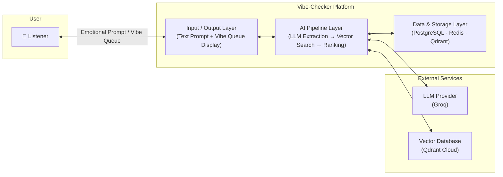

**Core Capabilities:**
- **Emotion-first interaction** — Users type how they feel in natural language; no keyword translation needed
- **LLM-powered understanding** — Groq Llama-3.1-8B-Instant interprets nuanced, metaphorical, and compound emotional expressions
- **Semantic retrieval** — BAAI/bge-small-en-v1.5 embeddings + Qdrant vector search surface emotionally relevant tracks
- **Emotion-aware ranking** — Custom ranking engine aligns tracks with audio feature targets (valence, energy, tempo, danceability, acousticness)
- **Instant queue generation** — Full Vibe Queue delivered in < 5 seconds from prompt submission
- **Single-turn simplicity** — One prompt → One queue. No conversation, no follow-ups, no session state complexity

---

## 2. Design Principles

Six governing principles drive every architectural decision in this system. They are derived directly from the product strategy and are non-negotiable across all components.

| # | Principle | Description | Architectural Implication |
|---|-----------|-------------|--------------------------|
| 1 | **Emotional Accuracy** | The system must faithfully interpret the user's emotional intent — not guess or approximate | LLM prompt engineering with dual-state extraction (current → desired); confidence scoring on every extraction |
| 2 | **Discovery Quality** | Vibe Queue tracks must be emotionally relevant AND diverse — not just popular or familiar | Semantic vector search over full dataset; diversity penalty in ranking; no popularity bias |
| 3 | **Low Latency** | Full Vibe Queue in < 5 seconds; UI response in < 1 second | Sequential pipeline with component-level latency budgets; Redis caching; Groq fast inference |
| 4 | **Retrieval Precision** | Retrieved tracks must acoustically match the extracted emotional profile | Audio feature alignment scoring (valence, energy, danceability, tempo, acousticness); multi-factor ranking |
| 5 | **User Trust** | Users must understand how their emotion was interpreted and why tracks were selected | Extracted emotional profile displayed alongside queue; confidence score visible on low-confidence results |
| 6 | **Simplicity** | One prompt → One queue. No complexity, no configuration, no learning curve | Single text input; no follow-up questions; no account required for first 3 prompts; no settings |

**Additional Design Tenets:**

- **Separation of Concerns** — Each pipeline component has a single well-defined responsibility
- **Cache-First** — Identical prompts served from Redis instantly; reduce LLM calls
- **Graceful Degradation** — Partial failures produce shorter queues with warnings, not errors
- **Transparency** — Always show the user how their emotion was interpreted (extracted profile). It should be human-understandable and AI-explainable

---

## 3. High-Level Architecture

The system is structured as a **three-layer stack** with external service integrations:

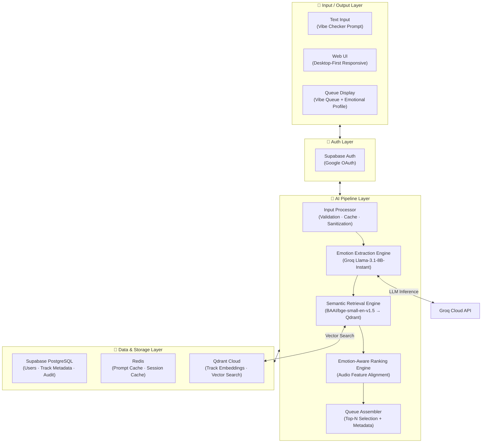

---

## 4. Layer-by-Layer Architecture

### 4.1 Input / Output Layer

Handles all user-facing interactions — prompt input and Vibe Queue rendering.

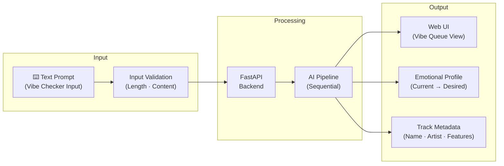

| Sub-Component | Role | Technology |
|---------------|------|------------|
| **Vibe Checker Input** | Persistent free-text input on Home page for emotional prompts | Next.js React component |
| **Input Validation** | Enforce character limits (500 max), sanitize input, check for harmful content | FastAPI middleware |
| **Vibe Queue Display** | Render the emotionally ordered track list with metadata and emotional profile | Next.js React component |
| **Emotional Profile Display** | Show extracted current state → desired state alongside the queue | Next.js React component |
| **Example Prompts** | Display 4–6 inspirational prompts on Home page for first-time users | Next.js static content |

---

### 4.2 Auth Layer

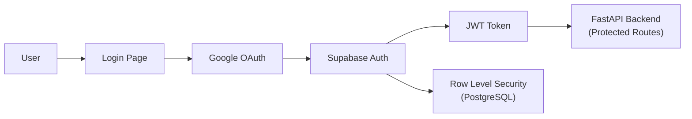

| Concern | Detail |
|---------|--------|
| **Provider** | Google OAuth only (v1) |
| **Token Management** | JWT issued by Supabase; verified on every API call |
| **Data Isolation** | Supabase Row Level Security (RLS) ensures users only access their own data |
| **Session Persistence** | Redis stores active session metadata for fast lookup |
| **Anonymous Access** | First 3 prompts allowed without sign-in (growth strategy) |

---

### 4.3 AI Pipeline Layer

The core intelligence pipeline — the "brain" of the system. Processes emotional prompts through five sequential stages.

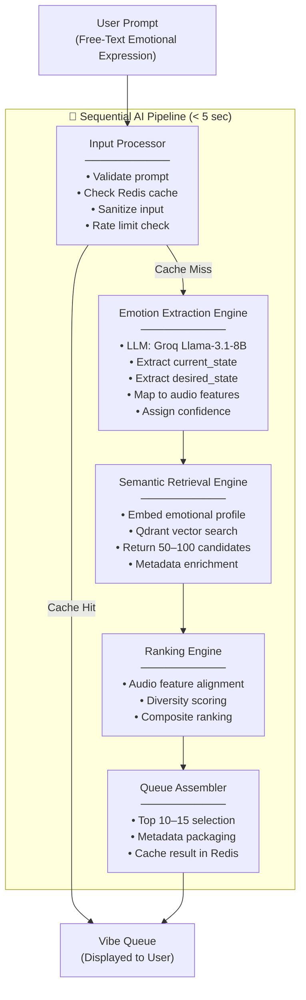

**Pipeline State** — data passed through each stage:

| State Key | Type | Set By | Read By |
|-----------|------|--------|---------|
| `raw_prompt` | string | Input Processor | Emotion Extraction Engine |
| `is_cached` | boolean | Input Processor | Pipeline Controller |
| `emotion_type` | "mixed_emotion" \| "current_with_desired" \| "desired_only" \| "current_only" | Emotion Extraction Engine | Ranking, Queue Assembler |
| `emotional_profile` | JSON object | Emotion Extraction Engine | Retrieval, Ranking, Queue Assembler |
| `current_state` | object (primary_emotion, secondary_emotion, energy, valence, ...) | Emotion Extraction Engine | Retrieval, Ranking |
| `desired_state` | object (primary_emotion, secondary_emotion, energy, valence, ...) | Emotion Extraction Engine | Ranking, Queue Assembler |
| `transition_type` | "maintain" \| "gradual" \| "immediate" | Emotion Extraction Engine | Ranking |
| `confidence` | float (0.0–1.0) | Emotion Extraction Engine | Queue Assembler (for warnings) |
| `candidate_tracks` | Track[] (50–100) | Semantic Retrieval Engine | Ranking Engine |
| `ranked_tracks` | Track[] (scored) | Ranking Engine | Queue Assembler |
| `vibe_queue` | VibeQueue object | Queue Assembler | Output / UI |
| `request_id` | string | Input Processor | All (observability) |

---

### 4.4 Data & Storage Layer

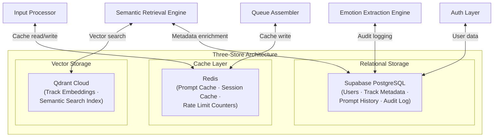

| Store | Purpose | Technology | Key Data |
|-------|---------|------------|----------|
| **PostgreSQL** | Relational data — users, track metadata, prompt history, audit logs | Supabase (managed) | `profiles`, `tracks`, `prompt_history`, `audit_log` |
| **Redis** | Fast cache — prompt→queue mappings, session tokens, rate limit counters | Redis (managed or self-hosted) | Prompt hash → Vibe Queue JSON, Session ID → User ID |
| **Qdrant** | Vector store — track embeddings for semantic similarity search | Qdrant Cloud (Free Tier) | Track ID → Embedding vector (384 dims) + metadata payload |

**Data stored in PostgreSQL (Supabase):**

| Table | Purpose | Key Fields |
|-------|---------|------------|
| `profiles` | User identity and session info | id, email, display_name, avatar_url, created_at |
| `tracks` | Spotify dataset track metadata | id, track_name, artist, album, valence, energy, danceability, tempo, acousticness, instrumentalness, loudness, speechiness, liveness, mode, duration_ms, popularity |
| `prompt_history` | User prompt and queue history | id, user_id, prompt_text, emotional_profile (JSONB), queue_result (JSONB), confidence, created_at |
| `audit_log` | Pipeline execution traces | id, request_id, component, action, input (JSONB), output (JSONB), latency_ms, created_at |

#### Database Schema DDL

```sql
-- =============================================
-- Users & Auth (managed by Supabase Auth)
-- =============================================

-- User Profiles
CREATE TABLE profiles (
    id UUID PRIMARY KEY REFERENCES auth.users(id),
    email TEXT UNIQUE NOT NULL,
    display_name TEXT,
    avatar_url TEXT,
    prompts_used INTEGER DEFAULT 0,
    created_at TIMESTAMPTZ DEFAULT NOW(),
    updated_at TIMESTAMPTZ DEFAULT NOW()
);

-- =============================================
-- Track Metadata (from Spotify Dataset)
-- =============================================

CREATE TABLE tracks (
    id TEXT PRIMARY KEY,                    -- Spotify track ID from dataset
    track_name TEXT NOT NULL,
    artist TEXT NOT NULL,
    album TEXT,
    valence REAL,                          -- 0.0–1.0
    energy REAL,                           -- 0.0–1.0
    danceability REAL,                     -- 0.0–1.0
    tempo REAL,                            -- BPM
    acousticness REAL,                     -- 0.0–1.0
    instrumentalness REAL,                 -- 0.0–1.0
    loudness REAL,                         -- dB
    speechiness REAL,                      -- 0.0–1.0
    liveness REAL,                         -- 0.0–1.0
    mode INTEGER,                          -- 0 (minor) or 1 (major)
    duration_ms INTEGER,
    popularity INTEGER,                    -- 0–100
    track_genre TEXT,
    embedding_text TEXT,                   -- Generated description for embedding
    indexed_at TIMESTAMPTZ DEFAULT NOW()
);

-- =============================================
-- Prompt History
-- =============================================

CREATE TABLE prompt_history (
    id UUID PRIMARY KEY DEFAULT gen_random_uuid(),
    user_id UUID REFERENCES profiles(id) ON DELETE CASCADE,
    prompt_text TEXT NOT NULL,
    emotional_profile JSONB,              -- Extracted emotional profile
    queue_result JSONB,                   -- Generated Vibe Queue
    confidence REAL,                      -- LLM confidence score
    latency_ms INTEGER,                   -- End-to-end pipeline latency
    cache_hit BOOLEAN DEFAULT FALSE,
    created_at TIMESTAMPTZ DEFAULT NOW()
);

-- =============================================
-- Audit Log (Pipeline Observability)
-- =============================================

CREATE TABLE audit_log (
    id UUID PRIMARY KEY DEFAULT gen_random_uuid(),
    request_id TEXT NOT NULL,
    component TEXT NOT NULL,               -- input_processor | emotion_extraction | retrieval | ranking | assembler
    action TEXT NOT NULL,                  -- validate | extract | search | rank | assemble
    input_data JSONB,
    output_data JSONB,
    latency_ms INTEGER,
    error TEXT,
    created_at TIMESTAMPTZ DEFAULT NOW()
);

-- =============================================
-- Row Level Security
-- =============================================

ALTER TABLE profiles ENABLE ROW LEVEL SECURITY;
ALTER TABLE prompt_history ENABLE ROW LEVEL SECURITY;

CREATE POLICY "Users can view own profile" ON profiles
    FOR SELECT USING (auth.uid() = id);

CREATE POLICY "Users can update own profile" ON profiles
    FOR UPDATE USING (auth.uid() = id);

CREATE POLICY "Users can view own prompt history" ON prompt_history
    FOR SELECT USING (auth.uid() = user_id);

CREATE POLICY "Users can insert own prompts" ON prompt_history
    FOR INSERT WITH CHECK (auth.uid() = user_id);

-- Tracks are publicly readable (no RLS needed)
-- Audit log is admin-only (default deny for non-admin)
```

---

## 5. Detailed Component Architecture

### 5.1 Pipeline Component Diagram

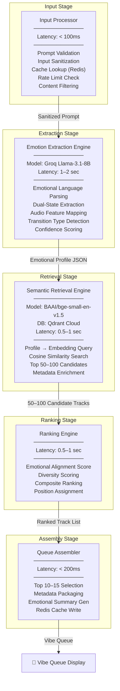

### 5.2 LLM Integration Architecture

The system uses a **single LLM provider** for emotion extraction — optimized for speed and cost:

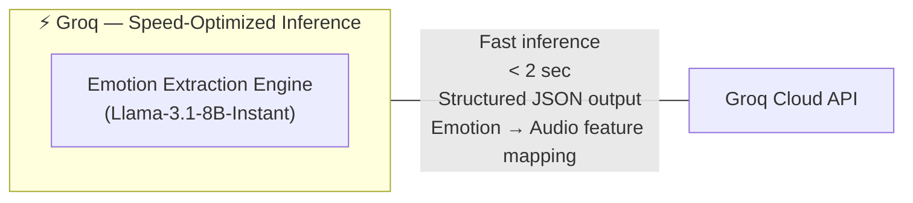

| Aspect | Detail |
|--------|--------|
| **Provider** | Groq Cloud API |
| **Model** | Llama-3.1-8B-Instant |
| **Use Case** | Structured emotion extraction from natural language |
| **Output Format** | JSON (current_state, desired_state, transition, confidence) |
| **Latency** | < 2 seconds per extraction |
| **Cost** | Very low (8B model, Groq speed pricing) |
| **Why Not Larger Model** | 8B is sufficient for structured extraction; speed is prioritized over creative reasoning |

### 5.3 Embedding & Retrieval Architecture

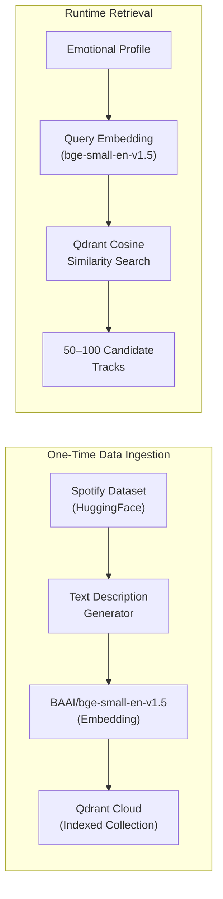

| Aspect | Detail |
|--------|--------|
| **Embedding Model** | BAAI/bge-small-en-v1.5 (384 dimensions) |
| **Vector Database** | Qdrant Cloud (Free Tier) |
| **Similarity Metric** | Cosine similarity |
| **Index Size** | ~114K tracks (full Spotify dataset) |
| **Query Latency** | 0.5–1 second |
| **Candidate Count** | 50–100 tracks per query |

### 5.4 Latency Budget

The end-to-end latency budget allocates time across pipeline components to meet the < 5 sec target:

| Component | Allocation | Running Total |
|-----------|-----------|---------------|
| Input Processor (validation + cache check) | < 100ms | 0.1 sec |
| Emotion Extraction Engine (LLM inference) | 1–2 sec | 2.1 sec |
| Semantic Retrieval Engine (vector search) | 0.5–1 sec | 3.1 sec |
| Ranking Engine (scoring + sorting) | 0.5–1 sec | 4.1 sec |
| Queue Assembler (selection + packaging) | < 200ms | 4.3 sec |
| **Total (worst case)** | **< 5 sec** | — |
| **Cache Hit (best case)** | **< 50ms** | — |

> [!NOTE]
> On a **cache hit** (identical prompt previously processed), the full pipeline is bypassed and the Vibe Queue is returned from Redis in < 50ms. Cache hit rate is expected to reach ≥ 20% after 30 days of usage.

---

## 6. Component Responsibilities & Key Interfaces

### 6.1 Input Processor

| Aspect | Detail |
|--------|--------|
| **Role** | Front gate — validates, sanitizes, caches, and rate-limits incoming prompts |
| **Latency** | < 100ms |

**Responsibilities:**
- Validate prompt is non-empty and ≤ 500 characters
- Sanitize input (strip HTML, prevent injection, filter harmful content)
- Normalize prompt for cache key (lowercase, trim whitespace, remove punctuation)
- Check Redis cache for existing Vibe Queue
- Enforce rate limits (20 prompts/user/hour; 3 prompts for anonymous users)
- Log incoming request with generated request_id

**Key Interfaces:**

| Interface | Direction | Data |
|-----------|-----------|------|
| `UI → Input Processor` | Input | Raw prompt text + session JWT |
| `Redis → Input Processor` | Input | Cached Vibe Queue (if exists) |
| `Input Processor → Emotion Extraction` | Output | Sanitized prompt (on cache miss) |
| `Input Processor → UI` | Output | Cached Vibe Queue (on cache hit) |

---

### 6.2 Emotion Extraction Engine

| Aspect | Detail |
|--------|--------|
| **Role** | Intelligence core — interprets emotional language and extracts structured signals |
| **Model** | Groq Llama-3.1-8B-Instant |
| **Latency** | 1–2 sec |

**Responsibilities:**
- Parse free-form emotional language (metaphorical, ambiguous, compound)
- Extract **current emotional state** (primary emotion, secondary emotion, energy, valence, danceability, tempo range, acousticness, instrumentalness)
- Extract **desired emotional state** (primary emotion, secondary emotion, energy, valence, danceability, tempo range, acousticness, instrumentalness)
- Classify **emotion type**: `mixed_emotion`, `current_with_desired`, `desired_only`, or `current_only`
- Determine **transition type** (maintain, gradual, immediate)
- Assign **confidence score** (0.0–1.0)
- Always return valid JSON matching the defined schema

**Emotion Type Classification:**

| Mood Prompt | Emotion Type | Classification |
|---|---|---|
| *"Feeling lonely but optimistic"* | **Mixed emotion** | `mixed_emotion` — two concurrent emotions in current state |
| *"Feeling low, need something that lifts me slowly"* | **Current + desired emotional outcome** | `current_with_desired` — current state + target state expressed |
| *"Give me something nostalgic"* | **Desired emotion** | `desired_only` — only target mood specified |
| *"I feel emotionally exhausted"* | **Current emotion** | `current_only` — only current state expressed |

**Sample Extraction Response Schema:**

```json
{
  "emotion_type": "mixed_emotion | current_with_desired | desired_only | current_only",
  "current_state": {
    "primary_emotion": "lonely",
    "secondary_emotion": "optimistic",
    "energy": "low_medium",
    "valence": 0.45,
    "danceability": 0.3,
    "tempo_range": [70, 100],
    "acousticness": 0.6,
    "instrumentalness": 0.3
  },
  "desired_state": {
    "primary_emotion": "hopeful",
    "secondary_emotion": null,
    "energy": "medium",
    "valence": 0.65,
    "danceability": 0.45,
    "tempo_range": [90, 120],
    "acousticness": 0.4,
    "instrumentalness": 0.2
  },
  "transition": {
    "type": "maintain | gradual | immediate"
  },
  "confidence": 0.85
}
```

**Key Interfaces:**

| Interface | Direction | Data |
|-----------|-----------|------|
| `Input Processor → Extraction` | Input | Sanitized prompt text |
| `Extraction → Retrieval` | Output | Structured emotional profile JSON |
| `Extraction → Groq API` | External | LLM inference call |
| `Extraction → Audit Log` | Output | Request ID, prompt, profile, latency |

**Prompt Engineering Principles:**

| Principle | Meaning |
|-----------|---------|
| **Emotion type classification** | Always classify the prompt's emotion pattern before extraction |
| **Dual-emotion awareness** | Extract both primary and secondary emotions in each state when present |
| **Dual-state awareness** | Always extract both current and desired states, even if user only describes one |
| **Conservative confidence** | Confidence < 0.5 for vague prompts; > 0.8 only for clear, specific emotional language |
| **Feature completeness** | Map to all Spotify audio features (valence, energy, danceability, tempo, acousticness, instrumentalness, loudness) |
| **Grounded output** | All audio feature values must be within valid Spotify ranges (0.0–1.0 for most, BPM for tempo) |
| **No hallucination** | Audio feature values must be logically derivable from the emotional input |

---

### 6.3 Semantic Retrieval Engine

| Aspect | Detail |
|--------|--------|
| **Role** | Search layer — finds candidate tracks whose embeddings are closest to the emotional profile |
| **Embedding Model** | BAAI/bge-small-en-v1.5 (384 dims) |
| **Vector DB** | Qdrant Cloud (Free Tier) |
| **Latency** | 0.5–1 sec |

**Responsibilities:**
- Convert extracted emotional profile into a text query for embedding
- Generate embedding query vector using bge-small-en-v1.5
- Execute cosine similarity search against Qdrant
- Return top 50–100 candidate tracks with similarity scores
- Enrich results with full metadata from PostgreSQL (track name, artist, album, audio features)
- Handle sparse results (< 20 candidates triggers soft failure warning)

**Key Interfaces:**

| Interface | Direction | Data |
|-----------|-----------|------|
| `Extraction → Retrieval` | Input | Emotional profile JSON |
| `Qdrant → Retrieval` | Input | Matching track IDs + similarity scores |
| `PostgreSQL → Retrieval` | Input | Full track metadata |
| `Retrieval → Ranking` | Output | 50–100 candidate tracks with scores + metadata |

---

### 6.4 Emotion-Aware Ranking Engine

| Aspect | Detail |
|--------|--------|
| **Role** | Quality layer — re-ranks candidates based on emotional alignment and diversity |
| **Latency** | 0.5–1 sec |
| **External Dependencies** | None (deterministic scoring logic) |

**Responsibilities:**
- Score each track on **emotional alignment** (how well its audio features match the extracted profile targets)
- Score each track on **diversity** (penalize same-artist clusters, same-genre saturation)
- Combine scores into a **composite ranking**
- Handle edge cases: if < 10 candidates, skip diversity penalty

**Scoring Formula:**

```
composite_score = (
    w1 × emotional_alignment_score +
    w2 × vector_similarity_score +
    w3 × diversity_score
)
```

Where:
- `w1 = 0.45` (emotional alignment — primary signal)
- `w2 = 0.35` (vector similarity — semantic relevance)
- `w3 = 0.20` (diversity — avoid monotony)

**Emotional Alignment Scoring:**

```
alignment_score = 1.0 - weighted_average(
    |track.valence - target.valence|,
    |track.energy - target.energy|,
    |track.danceability - target.danceability|,
    |track.acousticness - target.acousticness|,
    |track.tempo_normalized - target.tempo_normalized|
)
```

**Key Interfaces:**

| Interface | Direction | Data |
|-----------|-----------|------|
| `Retrieval → Ranking` | Input | Candidate tracks with similarity scores + metadata |
| `Extraction → Ranking` | Input | Emotional profile with audio feature targets |
| `Ranking → Queue Assembler` | Output | Ranked track list with composite scores |

---

### 6.5 Queue Assembler

| Aspect | Detail |
|--------|--------|
| **Role** | Final assembly — selects top tracks and packages them into a user-facing Vibe Queue |
| **Latency** | < 200ms |

**Responsibilities:**
- Select top 10–15 tracks from ranked list
- Package each track with display metadata (name, artist, album, key audio features)
- Generate emotional summary text: *"Your Vibe: Lonely → Hopeful (gradual lift). 12 tracks matched."*
- Store assembled Vibe Queue in Redis cache (keyed to normalized prompt hash, 24h TTL)
- Log queue generation in prompt_history table

**Key Interfaces:**

| Interface | Direction | Data |
|-----------|-----------|------|
| `Ranking → Queue Assembler` | Input | Ranked tracks |
| `Extraction → Queue Assembler` | Input | Emotional profile + confidence |
| `Queue Assembler → Redis` | Output | Cached Vibe Queue (prompt hash → queue JSON) |
| `Queue Assembler → PostgreSQL` | Output | Prompt history record |
| `Queue Assembler → UI` | Output | Final Vibe Queue JSON |

**Output Schema:**

```json
{
  "prompt": "feeling low, need something that lifts me slowly",
  "emotion_type": "current_with_desired",
  "emotional_profile": {
    "current": {
      "primary_emotion": "low",
      "secondary_emotion": null,
      "energy": 0.3,
      "valence": 0.25
    },
    "desired": {
      "primary_emotion": "uplifted",
      "secondary_emotion": null,
      "energy": 0.6,
      "valence": 0.7
    },
    "transition": "gradual"
  },
  "confidence": 0.85,
  "tracks": [
    {
      "position": 1,
      "track_name": "Skinny Love",
      "artist": "Bon Iver",
      "album": "For Emma, Forever Ago",
      "valence": 0.28,
      "energy": 0.25,
      "danceability": 0.32,
      "tempo": 76.0
    }
  ],
  "queue_size": 12,
  "generated_at": "2026-06-29T00:30:00Z"
}
```

---

### 6.6 Authentication & Session Layer

| Aspect | Detail |
|--------|--------|
| **Role** | User identity and session management via Google OAuth |
| **Technology** | Supabase Auth + JWT |

**Responsibilities:**
- Google OAuth sign-in / sign-up flow
- JWT session token management
- Associate prompts and queues with authenticated user sessions
- Rate limiting per user (20 prompts/hour authenticated, 3 total for anonymous)
- Session expiry after 24 hours with auto-refresh

**Key Interfaces:**

| Interface | Direction | Data |
|-----------|-----------|------|
| `UI → Auth` | Input | Google OAuth token |
| `Auth → UI` | Output | JWT session token |
| `Auth → API` | Middleware | JWT verification on every request |
| `Auth → PostgreSQL` | Output | User profile creation/lookup |

---

### 6.7 Caching Layer

| Aspect | Detail |
|--------|--------|
| **Role** | Reduces latency and LLM cost by serving cached Vibe Queues |
| **Technology** | Redis |

**Cache Targets:**

| Cache Key | TTL | Impact |
|-----------|-----|--------|
| Prompt hash → Vibe Queue | 24 hours | Bypass entire pipeline for identical prompts |
| Session ID → User context | Session duration | Fast session restore without DB lookup |
| Rate limit counters | 1 hour (sliding window) | Track per-user prompt count |

**Key Behaviors:**
- Normalize prompt before hashing: lowercase, strip whitespace, remove punctuation
- Cache only successful queue generations (not errors)
- Track cache hit/miss rates for observability
- Consider semantic similarity caching in v2 (serve cache for > 95% similar prompts)

---

### 6.8 Data Ingestion Pipeline (One-Time Setup)

| Aspect | Detail |
|--------|--------|
| **Role** | Pre-processes and indexes the Spotify Tracks Dataset for vector search |
| **Frequency** | One-time batch process (re-run on dataset updates) |

**Responsibilities:**
- Download and parse the [Spotify Tracks Dataset](https://huggingface.co/datasets/maharshipandya/spotify-tracks-dataset)
- Clean data: remove tracks with null audio features, deduplicate
- Generate text descriptions for each track based on audio features
  - Example: *"A low-energy, moderately positive acoustic track with slow tempo and gentle instrumentation"*
- Embed text descriptions using BAAI/bge-small-en-v1.5
- Index embeddings + metadata payload into Qdrant Cloud collection
- Store raw metadata in PostgreSQL `tracks` table

**Ingestion Flow:**

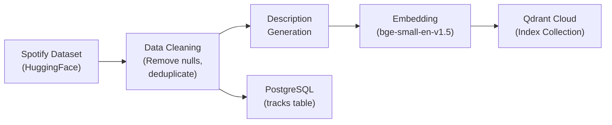

---

## 7. Data Flow & Sequence Diagrams

### 7.1 End-to-End Vibe Queue Generation Sequence

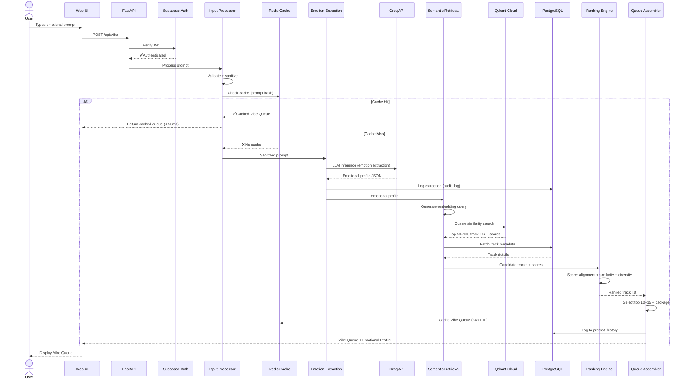

### 7.2 Anonymous User First Experience Flow

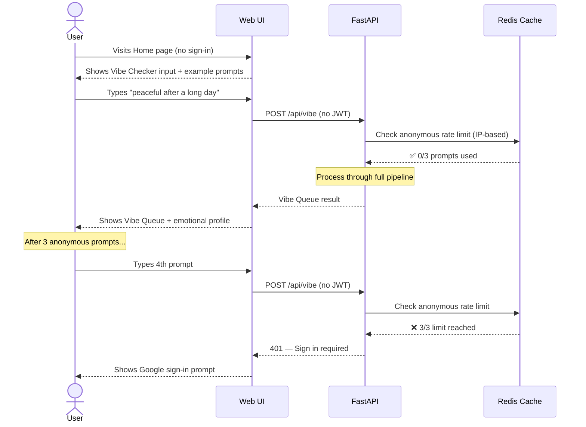

### 7.3 Low Confidence / Soft Failure Flow

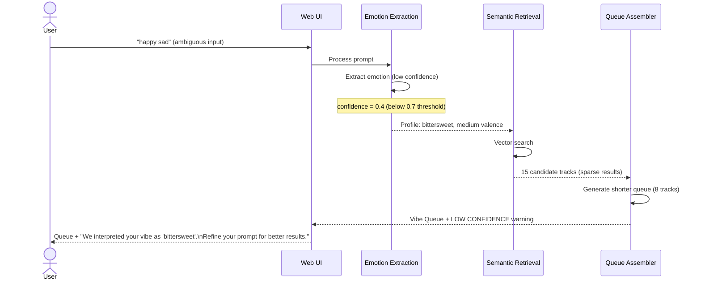

### 7.4 Hard Failure Flow

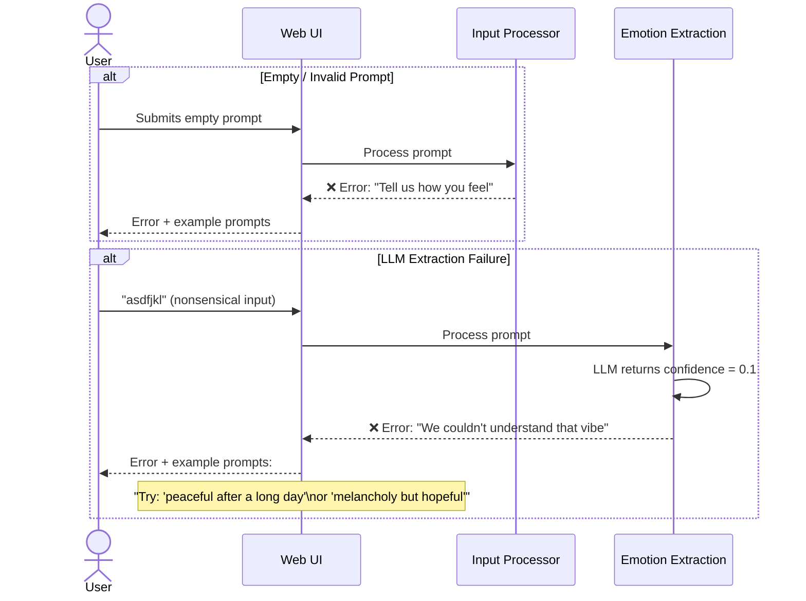

---

## 8. Technology Stack

### 8.1 Complete Technology Map

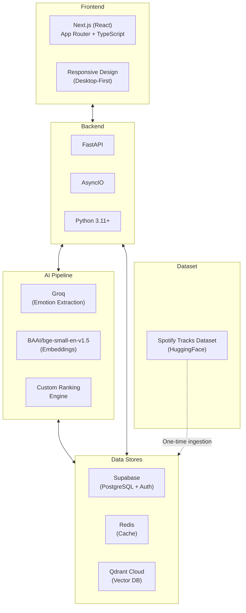

### 8.2 Stack Breakdown by Layer

| Layer | Technology | Role |
|-------|-----------|------|
| **Frontend** | Next.js (React) + TypeScript | Desktop-first web UI with App Router; Vibe Checker input + Queue display |
| **Backend** | FastAPI + AsyncIO (Python 3.11+) | REST API, pipeline orchestration, business logic |
| **LLM** | Groq — Llama-3.1-8B-Instant | Emotion extraction from natural language |
| **Embedding** | BAAI/bge-small-en-v1.5 | Text-to-vector for semantic retrieval (384 dims) |
| **Vector DB** | Qdrant Cloud (Free Tier) | Track embedding storage + cosine similarity search |
| **Auth** | Supabase Auth | Google OAuth, JWT tokens |
| **Database** | Supabase PostgreSQL | Users, track metadata, prompt history, audit log |
| **Cache** | Redis | Prompt→queue caching, session cache, rate limit counters |
| **Ranking** | Custom Python engine | Emotional alignment + diversity scoring |
| **Dataset** | [Spotify Tracks Dataset](https://huggingface.co/datasets/maharshipandya/spotify-tracks-dataset) | ~114K tracks with audio features for MVP validation |

---

## 9. Security Architecture & Principles

### 9.1 Security Architecture Diagram

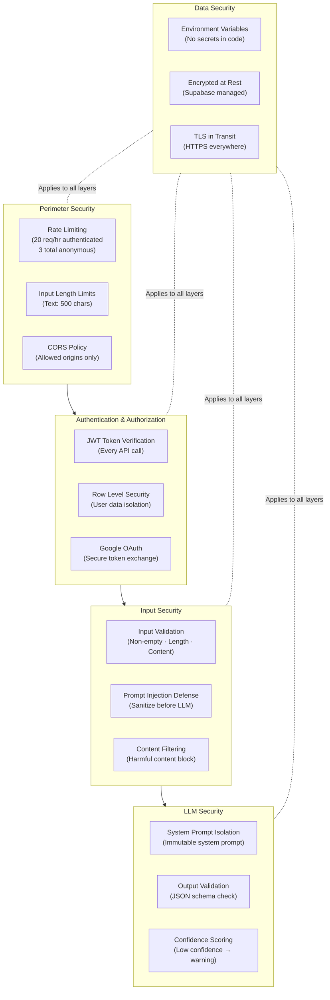

### 9.2 Security Principles

| Layer | Principle | Implementation |
|-------|-----------|----------------|
| **Perimeter** | Defense in depth | Rate limiting + input length limits + CORS policy |
| **Auth** | Zero trust | JWT verified on every request; no implicit trust |
| **Data Isolation** | Least privilege | Supabase RLS ensures users access only their own prompt history |
| **Input** | Never trust user input | Validate length, sanitize HTML, filter harmful content, defend against prompt injection |
| **LLM** | Controlled output | System prompt is immutable; output validated against JSON schema; confidence scoring for quality |
| **Secrets** | Never in code | All API keys via environment variables; `.env` never committed |
| **Transport** | Encrypt everything | TLS/HTTPS for all API calls (Groq, Qdrant, Supabase) |
| **Storage** | Encrypt at rest | Supabase-managed encryption for PostgreSQL; Qdrant Cloud managed encryption |

### 9.3 Prompt Injection Defenses

| Defense | Description |
|---------|-------------|
| **Input Sanitization** | Strip control characters, escape special tokens before passing to LLM |
| **System Prompt Isolation** | LLM system prompt is immutable and hard-coded; user input is isolated in designated variables |
| **Output Schema Validation** | LLM output must conform to defined JSON schema; malformed output triggers retry |
| **Confidence Gate** | Abnormally high confidence on unusual inputs may indicate injection; flagged for review |
| **Audit Trail** | Every LLM call logged with input, output, latency — post-incident investigation always possible |

---

## 10. Error Handling Strategy

### 10.1 Error Handling Architecture

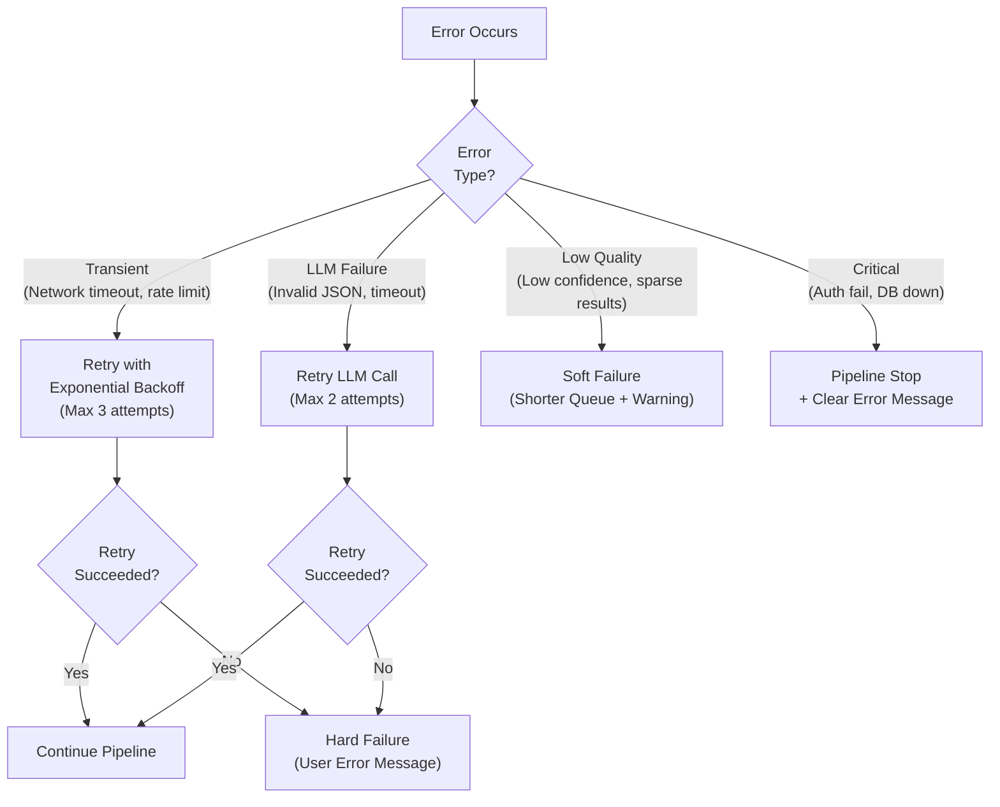

### 10.2 Error Categories & Strategies

| Category | Examples | Strategy | User Impact |
|----------|----------|----------|-------------|
| **Transient** | Groq API timeout, Qdrant rate limit, network blip | Retry with exponential backoff (max 3) | None (invisible to user) |
| **LLM Failure** | Invalid JSON response, extraction error | Retry once with stricter prompt; if fails → hard failure | User sees error with example prompts |
| **Low Confidence** | Vague input, ambiguous emotion, sparse search results | Generate shorter queue (5–10 tracks) with warning | User sees queue + refinement suggestion |
| **Search Sparse** | < 5 candidates from vector search | Hard failure — can't generate meaningful queue | User sees error: "We couldn't find enough matching tracks" |
| **Critical** | Auth failure, PostgreSQL down, Redis down (for cache) | Pipeline stops; clear error message | User asked to retry later |
| **Redis Down** | Cache layer unavailable | Bypass cache; process all prompts through full pipeline | Slightly higher latency; no user-facing error |

### 10.3 Error Messaging Principles

- ✅ **Empathetic:** *"We couldn't quite catch that vibe. Try something like 'peaceful after a long day.'"*
- ❌ **Clinical:** *"Error: Emotion extraction failed"*
- ✅ **Actionable:** *"Try describing how you feel — like 'melancholy but hopeful' or 'angry but want to calm down.'"*
- ❌ **Generic:** *"An error occurred"*
- ✅ **Transparent:** *"We interpreted your vibe as 'bittersweet.' Refine your prompt for a better match."*
- ❌ **Opaque:** *"Results may vary"*

---

## 11. Testing & Evaluation Strategy

### 11.1 Testing Strategy

| Test Type | Scope | Tools |
|-----------|-------|-------|
| **Unit Tests** | LLM prompt parsing, ranking scoring logic, input validation, cache key generation | pytest |
| **Integration Tests** | Pipeline stage-to-stage data flow, Qdrant search integration, Redis caching, Supabase auth | pytest + mocks |
| **End-to-End Tests** | Full pipeline: prompt → extraction → retrieval → ranking → queue | pytest + real APIs |
| **API Tests** | REST endpoint responses, error codes, auth flow | pytest + httpx |

### 11.2 Golden Prompt Dataset

Evaluate the system against a curated set of representative emotional prompts:

| # | Prompt | Emotion Complexity | Key Validation |
|---|--------|--------------------|----------------|
| 1 | "Feeling low, need something that lifts me slowly" | Medium | Dual-state extraction (low → uplifted); gradual transition |
| 2 | "Melancholy but hopeful" | Medium | Compound emotion; mixed valence |
| 3 | "Peaceful after a long day" | Low | Clear single emotion; low energy |
| 4 | "Angry but want to calm down" | High | Opposing states; energy descent |
| 5 | "Music that feels like rain after a difficult day" | High | Metaphorical language; cathartic calm |
| 6 | "Quiet confidence" | Medium | Subtle emotion; low energy + positive valence |
| 7 | "something chill" | Low | Vague input; default handling |
| 8 | "happy sad" | High | Contradictory; bittersweet extraction |
| 9 | "I feel empty but optimistic" | High | Paradoxical emotion; dual-state |
| 10 | "asdfjkl" | N/A | Nonsensical; hard failure expected |

### 11.3 Evaluation Metrics

| Category | Metric | Target |
|----------|--------|--------|
| **Quality** | Emotion extraction accuracy (user rates profile as matching intent) | ≥ 80% |
| **Quality** | Emotional alignment of queue (user rates queue as emotionally relevant) | ≥ 75% |
| **Quality** | Diversity (% of queue from unique artists) | ≥ 60% |
| **System** | End-to-end latency (p50) | < 3 seconds |
| **System** | End-to-end latency (p95) | < 5 seconds |
| **System** | Pipeline success rate | ≥ 95% |
| **System** | Cache hit rate (after 30 days) | ≥ 20% |
| **System** | LLM extraction valid JSON rate | ≥ 98% |

### 11.4 Performance Benchmarks

| Metric | Baseline (Manual Discovery) | Target (v1 Vibe-Checker) |
|--------|---------------------------|--------------------------|
| Time to first relevant track | 2–10 minutes | < 5 seconds |
| Skips before satisfaction | 5–15 skips | 0–2 skips |
| Discovery rate (new artists) | < 15% of listening | > 50% of queue |
| Emotional alignment | 0% (no understanding) | ≥ 75% perceived match |
| Input expressiveness | Keywords only | Free-form natural language |

---

## 12. Deployment & Execution Strategy

### 12.1 Deployment Architecture

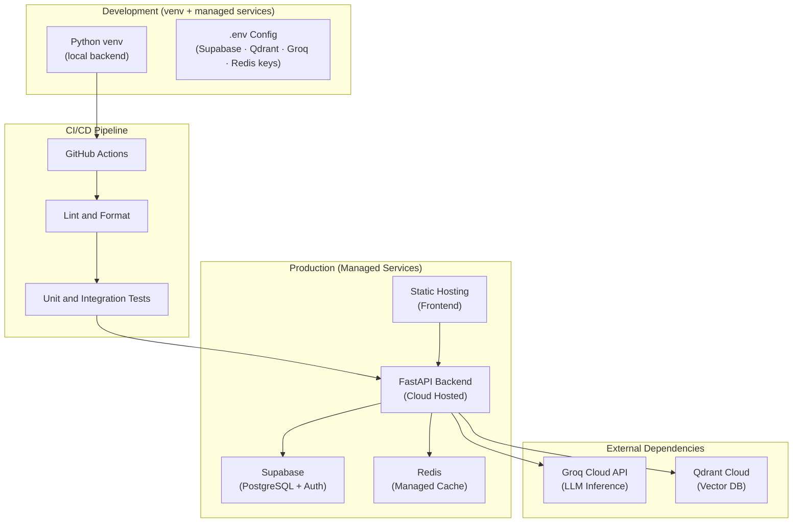

### 12.2 Environment Configuration

| Environment | Purpose | Data & Cache | When Used |
|-------------|---------|--------------|-----------|
| **Local** | Developer machine (venv) | **Redis** (managed / Upstash) + **Supabase** (cloud DB) + **Qdrant Cloud** (vector DB) | All feature development and testing |
| **Production** | Live user-facing system | **Supabase** + **Redis** (managed) + **Qdrant Cloud** | After deployment |

### 12.3 Local Development Setup

**Development uses Python venv + external managed services (no Docker):**

```
Local Development Stack
├── Python venv (backend/)      # FastAPI + AI Pipeline running locally via `uvicorn`
├── Supabase (managed)          # PostgreSQL + Auth (cloud — free tier)
├── Redis (managed / Upstash)   # Cache layer (cloud — free tier)
├── Qdrant Cloud (managed)      # Vector DB (cloud — free tier)
├── Groq Cloud API (external)   # LLM inference
└── frontend/ (served locally)  # Next.js dev server via `npm run dev`
```

**Setup Commands:**

```bash
# 1. Create and activate virtual environment
cd backend
python -m venv venv
venv\Scripts\activate          # Windows
# source venv/bin/activate     # macOS/Linux

# 2. Install dependencies
pip install -r requirements.txt

# 3. Configure environment
cp .env.example .env
# Edit .env with your Supabase, Qdrant, Groq, Redis keys

# 4. Run one-time data ingestion
python ../scripts/ingest_dataset.py

# 5. Start the backend
uvicorn app.main:app --reload --port 8000
```

**Production:**

```
Production Services
├── backend (cloud hosted)      # FastAPI + AI Pipeline
├── Supabase (managed)          # PostgreSQL + Auth (cloud)
├── Redis (managed)             # Cache layer (cloud)
├── Qdrant Cloud (managed)      # Vector DB (free tier)
├── Groq Cloud API (external)   # LLM inference
└── frontend (Vercel / static)  # Next.js deployed via Vercel or static export
```

### 12.4 Environment Variables

| Variable | Service | Description |
|----------|---------|-------------|
| `GROQ_API_KEY` | Groq | LLM inference API key |
| `QDRANT_URL` | Qdrant Cloud | Vector database endpoint |
| `QDRANT_API_KEY` | Qdrant Cloud | Vector database auth key |
| `SUPABASE_URL` | Supabase | PostgreSQL + Auth endpoint |
| `SUPABASE_ANON_KEY` | Supabase | Public client key (frontend auth) |
| `SUPABASE_SERVICE_KEY` | Supabase | Server-side service key (backend) |
| `REDIS_URL` | Redis | Cache connection URL |
| `HF_DATASET_PATH` | HuggingFace | Spotify dataset identifier |
| `EMBEDDING_MODEL` | HuggingFace | bge-small-en-v1.5 model identifier |
| `APP_ENV` | — | `local` or `production` |
| `FRONTEND_URL` | — | Frontend origin for CORS policy |

### 12.5 Execution Flow (Runtime)

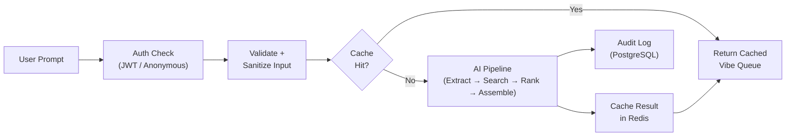

---

## 13. Directory Structure (Final State)

```
Vibe-Checker— Real-Time Emotional Context Discovery Layer/
│
├── 📁 backend/
│   ├── 📁 app/
│   │   ├── main.py                          # FastAPI entry point, middleware, CORS
│   │   ├── config.py                        # Pydantic settings, environment config
│   │   │
│   │   ├── 📁 routers/                      # API route handlers
│   │   │   ├── vibe.py                      #   POST /api/vibe — main prompt → queue endpoint
│   │   │   ├── auth.py                      #   Auth routes (Google OAuth login/callback)
│   │   │   ├── examples.py                  #   GET /api/examples — example prompts
│   │   │   └── health.py                    #   GET /api/health — system health check
│   │   │
│   │   ├── 📁 models/                       # Pydantic schemas & data models
│   │   │   ├── prompt.py                    #   PromptRequest, PromptResponse schemas
│   │   │   ├── emotion.py                   #   EmotionalProfile, CurrentState, DesiredState
│   │   │   ├── track.py                     #   Track, CandidateTrack, RankedTrack schemas
│   │   │   ├── queue.py                     #   VibeQueue, QueueTrack schemas
│   │   │   └── user.py                      #   User, Profile schemas
│   │   │
│   │   ├── 📁 pipeline/                     # AI pipeline components
│   │   │   ├── orchestrator.py              #   Pipeline orchestrator (sequences all stages)
│   │   │   ├── input_processor.py           #   Validation, sanitization, cache check
│   │   │   ├── emotion_extractor.py         #   LLM-powered emotion extraction (Groq)
│   │   │   ├── semantic_retriever.py        #   Embedding + Qdrant vector search
│   │   │   ├── ranking_engine.py            #   Emotional alignment + diversity scoring
│   │   │   └── queue_assembler.py           #   Top-N selection + packaging
│   │   │
│   │   ├── 📁 services/                     # Business logic services
│   │   │   ├── auth.py                      #   Supabase Auth wrapper
│   │   │   ├── cache.py                     #   Redis caching service
│   │   │   ├── groq_client.py               #   Groq API client wrapper
│   │   │   └── qdrant_client.py             #   Qdrant client wrapper
│   │   │
│   │   └── 📁 utils/                        # Shared utilities
│   │       ├── logging.py                   #   Structured JSON logging
│   │       ├── errors.py                    #   Custom exception classes
│   │       └── validators.py                #   Input validation helpers
│   │
│   ├── 📁 tests/
│   │   ├── 📁 unit/                         # Unit tests per component
│   │   │   ├── test_input_processor.py
│   │   │   ├── test_emotion_extractor.py
│   │   │   ├── test_ranking_engine.py
│   │   │   └── test_queue_assembler.py
│   │   ├── 📁 integration/                  # Stage-to-stage integration tests
│   │   │   ├── test_pipeline_flow.py
│   │   │   └── test_qdrant_search.py
│   │   └── 📁 e2e/                          # End-to-end pipeline tests
│   │       └── test_full_pipeline.py
│   │
│   ├── requirements.txt                     # Python dependencies
│   └── .env.example                         # Environment variable template
│
├── 📁 frontend/                             # Next.js Application
│   ├── 📁 app/                              # App Router pages
│   │   ├── layout.tsx                       #   Root layout (dark theme, fonts, metadata)
│   │   ├── page.tsx                         #   Home page (Vibe Checker input + Queue display)
│   │   ├── globals.css                      #   Design system (dark theme, variables, animations)
│   │   ├── 📁 auth/callback/
│   │   │   └── route.ts                     #   Google OAuth callback handler
│   │   └── 📁 history/
│   │       └── page.tsx                     #   Prompt history page (signed-in users)
│   │
│   ├── 📁 components/                       # React UI components
│   │   ├── VibeInput.tsx                    #   Vibe Checker prompt input
│   │   ├── ExamplePrompts.tsx               #   Clickable example prompts grid
│   │   ├── VibeQueue.tsx                    #   Queue display container
│   │   ├── TrackCard.tsx                    #   Individual track card
│   │   ├── EmotionalProfile.tsx             #   Emotional profile transparency display
│   │   ├── ConfidenceIndicator.tsx          #   Color-coded confidence score
│   │   ├── EmotionTypeBadge.tsx             #   Emotion type classification badge
│   │   ├── LoadingSkeleton.tsx              #   Loading animation skeleton
│   │   ├── ErrorDisplay.tsx                 #   Empathetic error state
│   │   ├── AuthButton.tsx                   #   Google sign-in/sign-out
│   │   ├── UserAvatar.tsx                   #   User avatar + name
│   │   ├── AnonymousCounter.tsx             #   "2 of 3 free prompts used"
│   │   └── Header.tsx                       #   Navigation header
│   │
│   ├── 📁 lib/                              # Utility modules
│   │   ├── api.ts                           #   Backend API client
│   │   ├── supabase-client.ts               #   Supabase browser client
│   │   ├── supabase-server.ts               #   Supabase server client (SSR)
│   │   └── types.ts                         #   TypeScript types (mirrors backend Pydantic models)
│   │
│   ├── 📁 hooks/                            # Custom React hooks
│   │   ├── useVibeQueue.ts                  #   Hook for vibe queue submission
│   │   └── useAuth.ts                       #   Hook for auth state
│   │
│   ├── 📁 public/                           # Static assets
│   │   ├── favicon.ico
│   │   └── 📁 icons/
│   │       └── vibe-checker-logo.svg        #   App logo
│   │
│   ├── next.config.ts                       # Next.js configuration
│   ├── package.json                         # Node dependencies
│   ├── tsconfig.json                        # TypeScript config
│   └── .env.local.example                   # Frontend env var template
│
├── 📁 scripts/
│   ├── ingest_dataset.py                    # One-time: download, clean, embed, index Spotify dataset
│   ├── seed_tracks.py                       # Seed PostgreSQL tracks table from dataset
│   └── test_golden_prompts.py               # Run golden prompt dataset evaluation
│
├── 📁 doc/
│   ├── problemStatement.md
│   ├── AIProductStrategy.md
│   ├── architecture.md                      #   ← This document
│   ├── phase-wise-implementationPlan.md     #   Phase-wise implementation plan
│   ├── eval.md                              #   Evaluation & exit criteria report
│   └── prompt.md
│
├── .env.example                             # Environment variable template
├── .gitignore
├── LICENSE
└── README.md
```

---

## Document History

| Version | Date | Changes |
|---------|------|---------|
| v1.0 | 2026-06-29 | Initial architecture document — system overview, design principles, layer architecture, component specs, data flows, technology stack, security, error handling, testing, deployment, directory structure |

---

> **Related Documents:**
> - [AIProductStrategy.md](AIProductStrategy.md) — Product strategy, system job descriptions, PM alignment
> - [problemStatement.md](problemStatement.md) — Problem statement, scope, tech stack, emotion understanding
