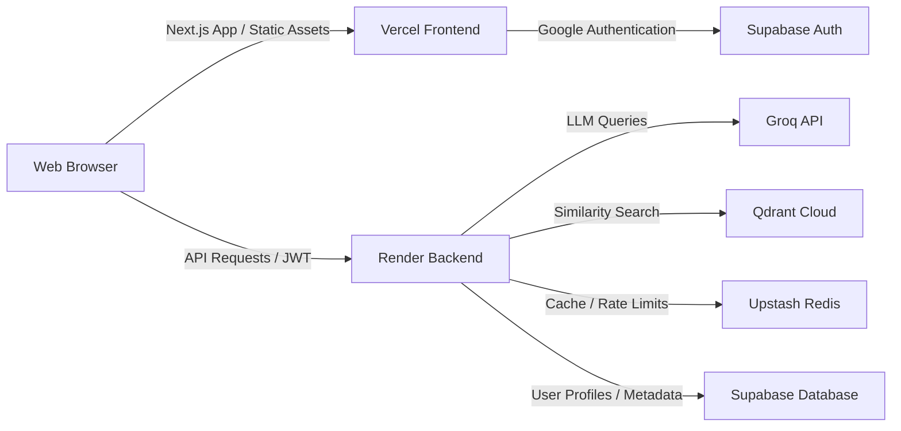

# Production Deployment Plan — Vibe-Checker

This deployment plan outlines the steps required to launch the Vibe-Checker application in a production environment using **Render** for the Python FastAPI backend and **Vercel** for the Next.js frontend.

---

## 🏗️ Deployment Architecture



---

## 1. Backend Deployment (Render)

Render will host the FastAPI backend service. You can deploy it using the **Blueprint (IaC)** option or **Manual Dashboard Setup**.

### Option A — Blueprint Deployment (Recommended)
We have provided a [render.yaml](file:///c:/Users/HP/OneDrive/Desktop/shiv1/programming%20project/Git_hub%20project/Vibe-Checker%E2%80%94%20Real-Time%20Emotional%20Context%20Discovery%20Layer/render.yaml) configuration in the root directory.
1. Log in to [Render](https://render.com/).
2. Select **Blueprints** from the top navigation.
3. Click **New Blueprint Instance**.
4. Connect your GitHub repository.
5. Render will automatically detect [render.yaml](file:///c:/Users/HP/OneDrive/Desktop/shiv1/programming%20project/Git_hub%20project/Vibe-Checker%E2%80%94%20Real-Time%20Emotional%20Context%20Discovery%20Layer/render.yaml) and prompt you for the empty environment variables (e.g. `GROQ_API_KEY`, `SUPABASE_URL`, etc.). Fill them in and click **Apply**.

### Option B — Manual Dashboard Setup
1. Log in to [Render](https://render.com/).
2. Click **New +** and select **Web Service**.
3. Connect your GitHub repository.
4. Configure the Web Service settings:
   - **Name:** `vibe-checker-backend`
   - **Runtime:** `Python3`
   - **Root Directory:** `backend` *(This isolates build/execution to the python folder)*
   - **Build Command:** `pip install -r requirements.txt`
   - **Start Command:** `uvicorn app.main:app --host 0.0.0.0 --port $PORT`
   - **Plan:** `Free`
5. To configure Python version 3.11.8 explicitly, add `PYTHON_VERSION` = `3.11.8` as an Environment Variable.

### Environment Variables
Under the **Environment** tab in Render, add the following variables:

| Variable | Value | Description |
|----------|-------|-------------|
| `APP_ENV` | `production` | Enables production configurations |
| `FRONTEND_URL` | `https://vibe-checker.vercel.app` | **Your Vercel frontend URL** (Required for CORS) |
| `GROQ_API_KEY` | `gsk_...` | Groq Console API Key |
| `QDRANT_URL` | `https://...` | Qdrant Cloud Cluster endpoint |
| `QDRANT_API_KEY` | `...` | Qdrant Cloud API Key |
| `SUPABASE_URL` | `https://...` | Supabase Project URL |
| `SUPABASE_ANON_KEY` | `...` | Supabase Anon Public Key |
| `SUPABASE_SERVICE_KEY` | `...` | Supabase Service Role Key (for secure backend SQL access) |
| `REDIS_URL` | `rediss://...` | Upstash Redis connection string (use SSL/rediss) |

---

## 2. Frontend Deployment (Vercel)

Vercel will host the Next.js App Router frontend. We have created a [vercel.json](file:///c:/Users/HP/OneDrive/Desktop/shiv1/programming%20project/Git_hub%20project/Vibe-Checker%E2%80%94%20Real-Time%20Emotional%20Context%20Discovery%20Layer/frontend/vercel.json) in the `frontend` folder containing security headers (e.g., XSS Protection, Referrer Policies) and clean routing rules.

### Step-by-Step Setup
1. Log in to [Vercel](https://vercel.com/).
2. Click **Add New** -> **Project**.
3. Connect your GitHub repository.
4. Configure the Project settings:
   - **Project Name:** `vibe-checker`
   - **Framework Preset:** `Next.js`
   - **Root Directory:** `frontend` *(This isolates build/execution to the Next.js folder)*
5. **Build and Development Settings:** Keep default options (Vercel will automatically read the [vercel.json](file:///c:/Users/HP/OneDrive/Desktop/shiv1/programming%20project/Git_hub%20project/Vibe-Checker%E2%80%94%20Real-Time%20Emotional%20Context%20Discovery%20Layer/frontend/vercel.json) and compile Next.js pages).

### Environment Variables
Under the **Environment Variables** section in Vercel, add the following keys:

| Variable | Value | Description |
|----------|-------|-------------|
| `NEXT_PUBLIC_API_URL` | `https://vibe-checker-backend.onrender.com` | **Your Render backend URL** |
| `NEXT_PUBLIC_SUPABASE_URL` | `https://...` | Supabase Project URL |
| `NEXT_PUBLIC_SUPABASE_ANON_KEY` | `...` | Supabase Anon Public Key |

---

## 3. Google OAuth & Auth Redirect Configurations

Since the production environment uses new domains, you must register the production URLs in your auth providers:

### Google Cloud Console (OAuth Client Credentials)
1. Go to the [Google Cloud Console Credentials](https://console.cloud.google.com/apis/credentials) page.
2. Edit your OAuth 2.0 Client ID used for this project.
3. In **Authorized Javascript Origins**, add:
   - `https://vibe-checker.vercel.app` (Vercel domain)
4. In **Authorized Redirect URIs**, add the callback URI supplied by Supabase:
   - `https://qmvwjqagjmvjmzeiboqs.supabase.co/auth/v1/callback` (replace with your project domain)

### Supabase Dashboard (Auth settings)
1. Go to the [Supabase Dashboard](https://supabase.com/) and navigate to your project.
2. Select **Authentication** -> **URL Configuration**.
3. Update the **Site URL** to your production Vercel frontend URL:
   - `https://vibe-checker.vercel.app/`
4. In **Redirect URLs**, add the OAuth callback route:
   - `https://vibe-checker.vercel.app/auth/callback`

---

## 4. Production Database & Ingestion

The production databases (Supabase PostgreSQL and Qdrant Cloud) are cloud-managed and can be seeded from your local environment by temporarily switching configuration keys in your local `.env`:

1. In your local `.env`, set:
   - `QDRANT_URL` and `QDRANT_API_KEY` to production cloud values.
   - `SUPABASE_URL` and `SUPABASE_SERVICE_KEY` to production cloud values.
2. Run the ingestion scripts locally:
   ```bash
   # Index vectors to Qdrant Cloud
   .\backend\venv\Scripts\python.exe scripts/ingest_dataset.py
   
   # Seed tracks metadata to Supabase PostgreSQL
   .\backend\venv\Scripts\python.exe scripts/seed_tracks.py
   ```
3. Once completed, restore the local testing credentials in your local `.env`.

---

## 5. Verification & Health Monitoring

1. **Backend Health Check:** Verify the Render service is alive by requesting:
   `https://vibe-checker-backend.onrender.com/api/health`
   It should return a `200 OK` status with all connected cloud dependencies (Redis, Supabase, Qdrant) flagged as healthy.
2. **Frontend Time to Interactive:** Monitor loading states in the Vercel dashboard.
3. **CORS Validation:** Verify that Web UI requests to the Render backend do not trigger preflight CORS blocking in the browser console.
