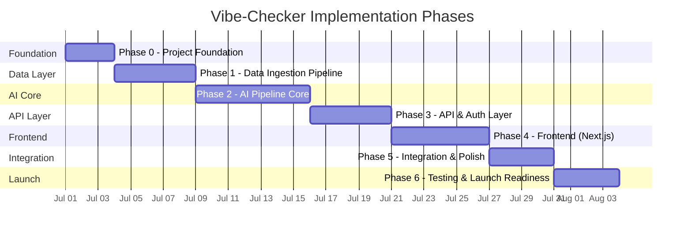

# Vibe-Checker — Phase-Wise Implementation Plan

> **Author:** Shiv
> **Date:** 2026-06-29
> **Status:** Implementation Blueprint
> **Source Docs:** [problemStatement.md](problemStatement.md) · [architecture.md](architecture.md) · [AIProductStrategy.md](AIProductStrategy.md)

---

## Implementation Overview

This document defines the **complete phase-wise implementation plan** for the Vibe-Checker — Real-Time Emotional Context Discovery Layer. Each phase is designed to be independently verifiable with clear exit criteria, evaluation files, and a full listing of files created.

**Technology Decisions:**

| Layer | Technology | Notes |
|-------|-----------|-------|
| **Backend** | Python 3.11+ / FastAPI / AsyncIO | Local development via `venv` |
| **Frontend** | Next.js (React) | Server-side rendering, API routes for BFF |
| **LLM** | Groq — Llama-3.1-8B-Instant | Emotion extraction |
| **Embeddings** | BAAI/bge-small-en-v1.5 (384 dims) | Semantic retrieval |
| **Vector DB** | Qdrant Cloud (Free Tier) | External managed service |
| **Database** | Supabase (PostgreSQL + Auth) | External managed service |
| **Cache** | Redis (Upstash / managed) | External managed service |
| **Infrastructure** | Python venv + external managed services | No Docker |

**Phase Roadmap:**



---

## Phase 0: Project Foundation & Environment Setup

### 🎯 Objective

Establish the project skeleton, configure all external managed services, set up the Python virtual environment, initialize the Next.js frontend project, and create shared configuration files. **Nothing runs yet — but everything is wired and ready.**

### 📋 Deliverables

| # | Deliverable | Description |
|---|-------------|-------------|
| 1 | Repository structure | Monorepo with `backend/`, `frontend/`, `scripts/`, `doc/` directories |
| 2 | Python venv | Backend virtual environment with core dependencies installed |
| 3 | Next.js project | Frontend project initialized with Next.js |
| 4 | External service accounts | Supabase project, Qdrant Cloud cluster, Groq API key, Redis (Upstash) instance |
| 5 | Environment configuration | `.env.example` with all required variables; `.env` populated locally |
| 6 | Supabase schema | Database tables created via SQL migration (`profiles`, `tracks`, `prompt_history`, `audit_log`) |
| 7 | Git setup | `.gitignore`, `LICENSE`, `README.md` |

### 🔧 Implementation Steps

**Step 0.1 — Repository & Directory Structure**
- Create the monorepo directory structure matching the architecture spec
- Initialize Git repository with `.gitignore` (Python, Node, .env, venv, __pycache__)

**Step 0.2 — Backend Environment**
- Create Python venv: `python -m venv venv`
- Install core dependencies: `fastapi`, `uvicorn`, `pydantic`, `pydantic-settings`, `httpx`, `redis`, `supabase`, `qdrant-client`, `groq`, `fastembed`, `python-dotenv`
- Freeze dependencies to `requirements.txt`

**Step 0.3 — Frontend Environment**
- Initialize Next.js project: `npx -y create-next-app@latest ./frontend`
- Configure project with App Router, TypeScript, ESLint
- Install additional dependencies: `@supabase/supabase-js`, `@supabase/auth-helpers-nextjs`

**Step 0.4 — External Service Setup**
- Create Supabase project → obtain `SUPABASE_URL`, `SUPABASE_ANON_KEY`, `SUPABASE_SERVICE_KEY`
- Enable Google OAuth provider in Supabase Auth dashboard
- Create Qdrant Cloud cluster (Free Tier) → obtain `QDRANT_URL`, `QDRANT_API_KEY`
- Obtain Groq API key → `GROQ_API_KEY`
- Create Upstash Redis instance → obtain `REDIS_URL`

**Step 0.5 — Database Schema**
- Execute DDL from [architecture.md — Database Schema](architecture.md#database-schema-ddl) in Supabase SQL Editor
- Create tables: `profiles`, `tracks`, `prompt_history`, `audit_log`
- Enable Row Level Security (RLS) policies
- Verify schema via Supabase Dashboard

**Step 0.6 — Configuration Files**
- Create `.env.example` with all environment variables
- Create `backend/app/config.py` with Pydantic Settings for type-safe configuration
- Create `backend/app/__init__.py`

### ✅ Evaluation Criteria → [eval.md](eval.md#phase-0)

| # | Criterion | Verification Method | Pass Condition |
|---|-----------|-------------------|----------------|
| 1 | Python venv activates | `venv\Scripts\activate` + `python --version` | Python 3.11+ reported |
| 2 | All dependencies install | `pip install -r requirements.txt` | Exit code 0, no errors |
| 3 | Next.js dev server starts | `cd frontend && npm run dev` | `localhost:3000` accessible |
| 4 | Supabase connection | Run test query against Supabase | Tables exist, RLS active |
| 5 | Qdrant Cloud reachable | `qdrant_client.get_collections()` | Returns empty collection list |
| 6 | Redis connection | `redis.ping()` | Returns `True` |
| 7 | Groq API reachable | Send test completion request | Returns valid response |
| 8 | Environment variables load | `config.py` instantiates without error | All required vars present |

### 📁 Files Created

```
Vibe-Checker— Real-Time Emotional Context Discovery Layer/
│
├── 📁 backend/
│   ├── 📁 app/
│   │   ├── __init__.py                       # Package init
│   │   └── config.py                         # Pydantic Settings (env var loading)
│   │
│   ├── requirements.txt                      # Python dependencies (pinned)
│   └── .env.example                          # Backend env var template
│
├── 📁 frontend/                              # Next.js project (initialized)
│   ├── 📁 app/                               # App Router pages
│   │   ├── layout.tsx                        # Root layout
│   │   ├── page.tsx                          # Home page (placeholder)
│   │   └── globals.css                       # Global styles
│   ├── 📁 public/                            # Static assets
│   │   └── favicon.ico
│   ├── next.config.ts                        # Next.js configuration
│   ├── package.json                          # Node dependencies
│   ├── tsconfig.json                         # TypeScript config
│   └── .env.local.example                    # Frontend env var template
│
├── 📁 scripts/
│   └── verify_services.py                    # Script to test all external service connections
│
├── 📁 doc/
│   ├── problemStatement.md
│   ├── AIProductStrategy.md
│   ├── architecture.md
│   ├── phase-wise-implementationPlan.md      # ← This document
│   └── prompt.md
│
├── 📁 supabase/
│   └── migrations/
│       └── 001_initial_schema.sql            # DDL: profiles, tracks, prompt_history, audit_log, RLS
│
├── .env.example                              # Root-level env var template
├── .gitignore                                # Python + Node + .env exclusions
├── LICENSE
└── README.md                                 # Project overview + setup instructions
```

---

## Phase 1: Data Ingestion Pipeline

### 🎯 Objective

Download the Spotify Tracks Dataset from HuggingFace, clean and transform the data, generate text descriptions for each track, create embeddings using BAAI/bge-small-en-v1.5, index embeddings into Qdrant Cloud, and seed track metadata into Supabase PostgreSQL. **After this phase, the database is populated and vector search is operational.**

### 📋 Deliverables

| # | Deliverable | Description |
|---|-------------|-------------|
| 1 | Dataset download script | Downloads Spotify Tracks Dataset from HuggingFace |
| 2 | Data cleaning logic | Handles nulls, deduplication, data type normalization |
| 3 | Text description generator | Converts audio features into natural-language descriptions for embedding |
| 4 | Embedding pipeline | Generates 384-dim embeddings using bge-small-en-v1.5 |
| 5 | Qdrant indexer | Creates collection, upserts embeddings + metadata payload |
| 6 | PostgreSQL seeder | Inserts cleaned track metadata into `tracks` table |
| 7 | Ingestion statistics | Logs total tracks processed, success rate, failures |

### 🔧 Implementation Steps

**Step 1.1 — Dataset Download & Exploration**
- Download dataset using `datasets` library from HuggingFace
- Explore schema: identify columns, data types, null rates
- Document data quality findings

**Step 1.2 — Data Cleaning**
- Remove duplicates (by track ID or track_name + artist combination)
- Handle null audio features: drop tracks with null `valence`, `energy`, or `danceability`
- Normalize data types (ensure floats for audio features, ints for duration/popularity)
- Validate ranges (valence 0–1, energy 0–1, etc.)

**Step 1.3 — Text Description Generation**
- Create a function that converts audio features to natural language:
  ```
  "A melancholic, low-energy acoustic track with slow tempo and intimate feel"
  ```
- Include: valence interpretation, energy level, acousticness, tempo description, instrumentalness, genre
- These descriptions become the input for embedding generation

**Step 1.4 — Embedding Generation**
- Load `BAAI/bge-small-en-v1.5` model via `fastembed`
- Batch-embed all track descriptions (384-dimensional vectors)
- Handle batch processing efficiently (batches of 32–256)

**Step 1.5 — Qdrant Indexing**
- Create Qdrant collection with cosine distance metric and 384 dims
- Upsert embeddings with metadata payload (track_id, track_name, artist, valence, energy, danceability, tempo, acousticness, instrumentalness)
- Verify collection size matches expected track count

**Step 1.6 — PostgreSQL Seeding**
- Insert cleaned track metadata into Supabase `tracks` table
- Batch insert for performance
- Verify row count matches Qdrant collection size

**Step 1.7 — Verification**
- Run test vector search query against Qdrant
- Run test SQL query against Supabase
- Verify embedding dimensionality and metadata payload structure

### ✅ Evaluation Criteria → [eval.md](eval.md#phase-1)

| # | Criterion | Verification Method | Pass Condition |
|---|-----------|-------------------|----------------|
| 1 | Dataset downloaded | Check local file / HF cache | Dataset loaded with expected column count |
| 2 | Data cleaned | Run cleaning stats | ≥ 90% of tracks retained after cleaning |
| 3 | Descriptions generated | Sample 10 descriptions | Readable, varied, include audio feature context |
| 4 | Embeddings generated | Check embedding shape | All embeddings are 384-dimensional float arrays |
| 5 | Qdrant indexed | `collection.count()` | Track count matches cleaned dataset |
| 6 | PostgreSQL seeded | `SELECT COUNT(*) FROM tracks` | Row count matches Qdrant collection count |
| 7 | Test vector search | Query "sad and slow music" | Returns relevant tracks with similarity scores > 0.5 |
| 8 | End-to-end ingestion time | Time full script execution | Completes within 30 minutes |

### 📁 Files Created

```
Vibe-Checker— Real-Time Emotional Context Discovery Layer/
│
├── 📁 backend/
│   └── 📁 app/
│       └── 📁 services/
│           └── qdrant_client.py              # Qdrant Cloud client wrapper (create collection, upsert, search)
│
├── 📁 scripts/
│   ├── ingest_dataset.py                     # Master ingestion script (download → clean → embed → index)
│   ├── seed_tracks.py                        # Seed PostgreSQL tracks table from cleaned dataset
│   └── 📁 data/
│       └── .gitkeep                          # Placeholder for downloaded dataset cache
│
└── 📁 supabase/
    └── migrations/
        └── 001_initial_schema.sql            # (Created in Phase 0 — tracks table used here)
```

---

## Phase 2: AI Pipeline Core

### 🎯 Objective

Build the five-stage sequential AI pipeline — Input Processor → Emotion Extraction Engine → Semantic Retrieval Engine → Ranking Engine → Queue Assembler. Each component is built as an independent module with typed inputs/outputs. **After this phase, the full pipeline can process a raw prompt and return a Vibe Queue as a JSON object (CLI-testable, no API yet).**

### 📋 Deliverables

| # | Deliverable | Description |
|---|-------------|-------------|
| 1 | Pydantic data models | Typed schemas: `PromptRequest`, `EmotionalProfile`, `CurrentState`, `DesiredState`, `CandidateTrack`, `RankedTrack`, `VibeQueue` |
| 2 | Input Processor | Validation, sanitization, cache check, rate limit logic |
| 3 | Emotion Extraction Engine | Groq LLM integration, prompt engineering, JSON schema enforcement, emotion type classification |
| 4 | Semantic Retrieval Engine | Embedding query generation, Qdrant cosine search, metadata enrichment |
| 5 | Ranking Engine | Emotional alignment scoring, diversity penalty, composite ranking, position assignment |
| 6 | Queue Assembler | Top 10–15 selection, metadata packaging, emotional summary, Redis cache write |
| 7 | Pipeline Orchestrator | Sequences all stages, handles cache hits, error propagation |
| 8 | Unit tests for each component | pytest tests with mocks for external services |

### 🔧 Implementation Steps

**Step 2.1 — Pydantic Data Models**
- Create all typed schemas per [architecture.md — Pipeline State table](architecture.md#43-ai-pipeline-layer)
- Include `emotion_type` enum: `mixed_emotion`, `current_with_desired`, `desired_only`, `current_only`
- Validate all fields with Pydantic field validators

**Step 2.2 — Input Processor**
- Validate non-empty, ≤ 500 characters
- Sanitize: strip HTML, escape special characters
- Content filtering: basic profanity/harmful content check
- Cache lookup: normalize prompt → hash → Redis GET
- Rate limit check: per-user counter in Redis
- Return sanitized prompt or cached queue

**Step 2.3 — Emotion Extraction Engine (LLM)**
- Design system prompt with structured output constraints
- Implement Groq API call via `groq` Python SDK
- Parse LLM JSON response into `EmotionalProfile` Pydantic model
- Classify `emotion_type` for every prompt
- Extract `primary_emotion` + `secondary_emotion` in both states
- Map emotions to audio feature targets (valence, energy, danceability, tempo, acousticness, instrumentalness)
- Implement retry logic: max 2 retries on invalid JSON
- Assign confidence score

**Step 2.4 — Semantic Retrieval Engine**
- Convert emotional profile → text query for embedding
- Generate query embedding using bge-small-en-v1.5
- Execute Qdrant cosine similarity search (top 50–100 candidates)
- Enrich results with full metadata from PostgreSQL (join on track_id)
- Handle sparse results: warn if < 20 candidates

**Step 2.5 — Ranking Engine**
- Compute emotional alignment score per candidate:
  - Valence distance (weighted 0.35)
  - Energy distance (weighted 0.25)
  - Danceability match (weighted 0.15)
  - Tempo match (weighted 0.10)
  - Acousticness match (weighted 0.15)
- Apply diversity penalty (consecutive same-artist penalty)
- Compute composite score: `similarity_score × 0.25 + alignment_score × 0.35 + arc_score × 0.25 + diversity_score × 0.15`
- Assign positions based on emotional arc (current_state → desired_state)
- Sort by composite score

**Step 2.6 — Queue Assembler**
- Select top 10–15 tracks from ranked list
- Package with display metadata (track_name, artist, album, valence, energy, danceability, tempo)
- Generate emotional summary: `"Your Vibe: Lonely → Hopeful (gradual lift). 12 tracks matched."`
- Write assembled Vibe Queue to Redis cache (prompt hash → JSON, 24h TTL)
- Log to `prompt_history` and `audit_log` in PostgreSQL
- Include `emotion_type`, `emotional_profile`, and `confidence` in output

**Step 2.7 — Pipeline Orchestrator**
- Sequence all stages: Input → Extract → Retrieve → Rank → Assemble
- Handle cache hits (skip pipeline, return cached queue)
- Propagate errors with context and request IDs
- Time each stage, log total pipeline latency

**Step 2.8 — Unit Tests**
- Test each component independently with mocked dependencies
- Test edge cases: empty prompt, max-length prompt, nonsensical input, contradictory emotions
- Test LLM response parsing with fixture JSON files

### ✅ Evaluation Criteria → [eval.md](eval.md#phase-2)

| # | Criterion | Verification Method | Pass Condition |
|---|-----------|-------------------|----------------|
| 1 | Models validate correctly | Pydantic model tests | All models accept valid data, reject invalid data |
| 2 | Input Processor rejects bad input | Unit test with edge cases | Empty, >500 chars, harmful content → rejected |
| 3 | Emotion Extraction returns valid JSON | Test with 10 golden prompts | ≥ 8/10 return valid `EmotionalProfile` with correct `emotion_type` |
| 4 | Semantic Retrieval returns candidates | Test search query | Returns 50–100 candidates with similarity > 0.3 |
| 5 | Ranking produces ordered results | Test with mock candidates | Output sorted by composite score, diversity enforced |
| 6 | Queue Assembler produces valid queue | Test with ranked input | Returns 10–15 tracks with metadata + emotional summary |
| 7 | Pipeline end-to-end | Run orchestrator with real prompt | Returns complete Vibe Queue JSON in < 5 sec |
| 8 | Cache hit works | Run same prompt twice | Second call returns cached result in < 50ms |
| 9 | Unit tests pass | `pytest backend/tests/unit/` | All tests green |

### 📁 Files Created

```
Vibe-Checker— Real-Time Emotional Context Discovery Layer/
│
├── 📁 backend/
│   ├── 📁 app/
│   │   ├── 📁 models/                        # Pydantic schemas & data models
│   │   │   ├── __init__.py
│   │   │   ├── prompt.py                     # PromptRequest, PromptResponse schemas
│   │   │   ├── emotion.py                    # EmotionType enum, EmotionalProfile, CurrentState, DesiredState
│   │   │   ├── track.py                      # Track, CandidateTrack, RankedTrack schemas
│   │   │   ├── queue.py                      # VibeQueue, QueueTrack schemas
│   │   │   └── user.py                       # User, Profile schemas
│   │   │
│   │   ├── 📁 pipeline/                      # AI pipeline components
│   │   │   ├── __init__.py
│   │   │   ├── orchestrator.py               # Pipeline orchestrator (sequences all stages)
│   │   │   ├── input_processor.py            # Validation, sanitization, cache check
│   │   │   ├── emotion_extractor.py          # LLM-powered emotion extraction (Groq)
│   │   │   ├── semantic_retriever.py         # Embedding + Qdrant vector search
│   │   │   ├── ranking_engine.py             # Emotional alignment + diversity scoring
│   │   │   └── queue_assembler.py            # Top-N selection + packaging
│   │   │
│   │   └── 📁 services/                      # Business logic services
│   │       ├── __init__.py
│   │       ├── cache.py                      # Redis caching service (get, set, normalize, hash)
│   │       └── groq_client.py                # Groq API client wrapper
│   │
│   └── 📁 tests/
│       └── 📁 unit/                          # Unit tests per component
│           ├── __init__.py
│           ├── test_input_processor.py
│           ├── test_emotion_extractor.py
│           ├── test_semantic_retriever.py
│           ├── test_ranking_engine.py
│           └── test_queue_assembler.py
```

---

## Phase 3: API & Auth Layer

### 🎯 Objective

Expose the AI pipeline through FastAPI REST endpoints, implement Google OAuth authentication via Supabase, enforce rate limiting and security policies, and add structured logging / audit trail. **After this phase, the full backend is operational and can be tested with any HTTP client (curl, Postman, httpx).**

### 📋 Deliverables

| # | Deliverable | Description |
|---|-------------|-------------|
| 1 | FastAPI application | Entry point with middleware, CORS, lifespan events |
| 2 | API routes | `POST /api/vibe`, `GET /api/examples`, `GET /api/health`, auth routes |
| 3 | Auth integration | Google OAuth via Supabase, JWT verification middleware |
| 4 | Rate limiting | Per-user rate limits (20/hr authenticated, 3 total anonymous) |
| 5 | Error handling | Structured error responses with empathetic messages |
| 6 | Structured logging | JSON-formatted logs with request IDs |
| 7 | API tests | pytest + httpx tests for all endpoints |

### 🔧 Implementation Steps

**Step 3.1 — FastAPI Application Setup**
- Create `main.py` with FastAPI app instance
- Configure CORS middleware (allowed origins from env)
- Add lifespan events: initialize Redis, Qdrant, Supabase clients on startup
- Add request ID middleware (UUID per request)

**Step 3.2 — API Routes**
- `POST /api/vibe` — Accept prompt, run pipeline, return Vibe Queue
- `GET /api/examples` — Return 6 example prompts (static)
- `GET /api/health` — System health check (Redis ping, Qdrant status, Supabase status)
- `POST /api/auth/google` — Handle Google OAuth callback
- `GET /api/auth/me` — Return current user profile

**Step 3.3 — Authentication**
- Implement Supabase Auth integration for Google OAuth
- JWT verification middleware: extract Bearer token, verify via Supabase
- Anonymous access: allow first 3 prompts without sign-in (tracked by client fingerprint)
- Protected routes: `/api/vibe` (after 3 anonymous uses), `/api/auth/me`

**Step 3.4 — Rate Limiting**
- Redis-based rate limiting: per-user counters with TTL
- Authenticated: 20 requests/hour
- Anonymous: 3 total lifetime requests
- Return `429 Too Many Requests` with retry-after header

**Step 3.5 — Error Handling**
- Implement custom exception classes per [architecture.md — Error Handling](architecture.md#10-error-handling-strategy)
- Map exceptions to HTTP status codes
- Empathetic error messages for user-facing errors
- Structured error response: `{ "error": { "code": "...", "message": "...", "suggestion": "..." } }`

**Step 3.6 — Logging & Audit**
- Structured JSON logging with `structlog` or custom logging setup
- Log every pipeline execution with request ID, latency, cache hit/miss
- Write audit log entries to `audit_log` table in PostgreSQL
- Include component-level timing in audit entries

**Step 3.7 — API Tests**
- Test all endpoints with `httpx.AsyncClient`
- Test auth flow (mock Supabase)
- Test rate limiting
- Test error responses
- Test cache behavior

### ✅ Evaluation Criteria → [eval.md](eval.md#phase-3)

| # | Criterion | Verification Method | Pass Condition |
|---|-----------|-------------------|----------------|
| 1 | Server starts | `uvicorn app.main:app --reload` | Server running on `localhost:8000` |
| 2 | Health check passes | `GET /api/health` | Returns `200 OK` with all services healthy |
| 3 | Vibe endpoint works | `POST /api/vibe` with test prompt | Returns valid Vibe Queue JSON in < 5 sec |
| 4 | Examples endpoint works | `GET /api/examples` | Returns array of 6 example prompts |
| 5 | Auth flow works | Complete Google OAuth cycle | JWT issued and verified successfully |
| 6 | Rate limiting enforced | Send 21 requests in quick succession | 21st request returns `429` |
| 7 | Error messages are empathetic | Send empty prompt | Returns helpful error with suggestion |
| 8 | Audit log populated | Check `audit_log` table after requests | Entries present with request_id and latency |
| 9 | API tests pass | `pytest backend/tests/` | All tests green |

### 📁 Files Created

```
Vibe-Checker— Real-Time Emotional Context Discovery Layer/
│
├── 📁 backend/
│   └── 📁 app/
│       ├── main.py                           # FastAPI entry point, middleware, CORS, lifespan
│       │
│       ├── 📁 routers/                       # API route handlers
│       │   ├── __init__.py
│       │   ├── vibe.py                       # POST /api/vibe — main prompt → queue endpoint
│       │   ├── auth.py                       # Auth routes (Google OAuth login/callback/me)
│       │   ├── examples.py                   # GET /api/examples — example prompts
│       │   └── health.py                     # GET /api/health — system health check
│       │
│       ├── 📁 services/
│       │   └── auth.py                       # Supabase Auth wrapper (JWT verify, user profile)
│       │
│       ├── 📁 middleware/
│       │   ├── __init__.py
│       │   ├── request_id.py                 # UUID per request middleware
│       │   └── rate_limiter.py               # Redis-based rate limiting middleware
│       │
│       └── 📁 utils/
│           ├── __init__.py
│           ├── logging.py                    # Structured JSON logging setup
│           ├── errors.py                     # Custom exception classes + error mappings
│           └── validators.py                 # Input validation helpers
│
├── 📁 backend/tests/
│   ├── conftest.py                           # Shared fixtures (test client, mocks)
│   ├── 📁 api/                               # API endpoint tests
│   │   ├── __init__.py
│   │   ├── test_vibe_endpoint.py
│   │   ├── test_auth_endpoint.py
│   │   ├── test_examples_endpoint.py
│   │   └── test_health_endpoint.py
│   └── 📁 integration/
│       ├── __init__.py
│       └── test_pipeline_flow.py             # Integration test: API → pipeline → response
```

---

## Phase 4: Frontend (Next.js)

### 🎯 Objective

Build the Vibe-Checker user interface using Next.js with App Router. Implement the Home page with the persistent Vibe Checker prompt input, the Vibe Queue display with emotional profile transparency, Google OAuth sign-in, and responsive design. **After this phase, the full user-facing application is functional end-to-end.**

### 📋 Deliverables

| # | Deliverable | Description |
|---|-------------|-------------|
| 1 | Home page | Persistent Vibe Checker input with example prompts |
| 2 | Vibe Queue display | Track list with metadata + emotional profile + confidence |
| 3 | Emotional profile display | Current → Desired state visualization (AI-explainable) |
| 4 | Loading state | Animated loading during pipeline processing |
| 5 | Error states | Empathetic error messages matching backend error responses |
| 6 | Google OAuth | Sign-in/sign-out flow via Supabase |
| 7 | Responsive design | Desktop-first, mobile-friendly |
| 8 | Dark mode | Spotify-inspired dark theme |

### 🔧 Implementation Steps

**Step 4.1 — Design System & Layout**
- Create global CSS with dark theme (Spotify-inspired color palette)
- Set up Inter/Outfit font from Google Fonts
- Define CSS variables for colors, spacing, typography
- Create root layout with navigation and footer
- Implement responsive breakpoints

**Step 4.2 — Home Page — Vibe Checker Input**
- Persistent text input with placeholder: *"How are you feeling today?"*
- Submit button with loading state
- Example prompts section (6 clickable examples)
- Auto-focus on input on page load
- Character counter (max 500)

**Step 4.3 — Vibe Queue Display**
- Track card component: position, track name, artist, album, audio features
- Emotional profile card: Current State → Desired State with emotion type badge
- Confidence indicator (color-coded: green ≥ 0.8, yellow 0.5–0.8, red < 0.5)
- Emotional summary text: *"Your Vibe: Lonely → Hopeful (gradual lift). 12 tracks matched."*
- Queue metadata: track count, pipeline latency, cache hit indicator

**Step 4.4 — Emotional Profile Transparency**
- Render extracted `emotion_type` with human-readable label
- Show `primary_emotion` and `secondary_emotion` for both states
- Display audio feature targets (valence, energy, danceability) as visual indicators
- Show transition type (maintain / gradual / immediate)
- This section fulfills the **User Trust** design principle

**Step 4.5 — Authentication UI**
- Google Sign-In button (Supabase Auth)
- Sign-out button
- User avatar and display name in header
- Anonymous usage counter: "2 of 3 free prompts used"
- Sign-in prompt after 3 anonymous uses

**Step 4.6 — Loading & Error States**
- Skeleton loading animation during pipeline processing
- Pulsing gradient animation on the Vibe Checker input
- Error states with empathetic messages matching backend errors
- "Try again" with prompt suggestions on error

**Step 4.7 — API Integration**
- Create API client utility for backend communication
- Handle auth token injection in headers
- Error response parsing and display
- Optimistic UI updates

### ✅ Evaluation Criteria → [eval.md](eval.md#phase-4)

| # | Criterion | Verification Method | Pass Condition |
|---|-----------|-------------------|----------------|
| 1 | Home page renders | Navigate to `localhost:3000` | Vibe Checker input visible, example prompts displayed |
| 2 | Prompt submission works | Enter prompt, click submit | Vibe Queue displayed within 5 seconds |
| 3 | Emotional profile visible | Submit prompt, check display | Current/Desired states shown with emotion types |
| 4 | Confidence indicator works | Submit vague prompt vs clear prompt | Color changes appropriately |
| 5 | Google OAuth works | Click sign-in | User signed in, avatar displayed |
| 6 | Anonymous limit enforced | Submit 4 prompts without signing in | 4th prompt shows sign-in prompt |
| 7 | Error states display | Submit empty/nonsensical prompt | Empathetic error with suggestions shown |
| 8 | Responsive design | Resize to mobile viewport | Layout adapts, all elements accessible |
| 9 | Dark mode | Visual inspection | Spotify-inspired dark theme consistent |
| 10 | Loading animation | Submit prompt, observe UI | Skeleton/animation visible during processing |

### 📁 Files Created

```
Vibe-Checker— Real-Time Emotional Context Discovery Layer/
│
├── 📁 frontend/
│   ├── 📁 app/
│   │   ├── layout.tsx                        # Root layout (dark theme, fonts, metadata)
│   │   ├── page.tsx                          # Home page (Vibe Checker input + Queue display)
│   │   ├── globals.css                       # Design system (dark theme, variables, animations)
│   │   │
│   │   ├── 📁 auth/
│   │   │   └── 📁 callback/
│   │   │       └── route.ts                  # Google OAuth callback handler
│   │   │
│   │   └── 📁 history/
│   │       └── page.tsx                      # Prompt history page (signed-in users)
│   │
│   ├── 📁 components/
│   │   ├── VibeInput.tsx                     # Vibe Checker prompt input component
│   │   ├── ExamplePrompts.tsx                # Clickable example prompts grid
│   │   ├── VibeQueue.tsx                     # Queue display container
│   │   ├── TrackCard.tsx                     # Individual track card component
│   │   ├── EmotionalProfile.tsx              # Emotional profile transparency display
│   │   ├── ConfidenceIndicator.tsx           # Color-coded confidence score
│   │   ├── EmotionTypeBadge.tsx              # Emotion type classification badge
│   │   ├── LoadingSkeleton.tsx               # Loading animation skeleton
│   │   ├── ErrorDisplay.tsx                  # Empathetic error state component
│   │   ├── AuthButton.tsx                    # Google sign-in/sign-out button
│   │   ├── UserAvatar.tsx                    # User avatar + name in header
│   │   ├── AnonymousCounter.tsx              # "2 of 3 free prompts used"
│   │   └── Header.tsx                        # Navigation header
│   │
│   ├── 📁 lib/
│   │   ├── api.ts                            # Backend API client (fetch wrapper)
│   │   ├── supabase-client.ts                # Supabase browser client
│   │   ├── supabase-server.ts                # Supabase server client (for SSR)
│   │   └── types.ts                          # TypeScript types matching backend Pydantic models
│   │
│   ├── 📁 hooks/
│   │   ├── useVibeQueue.ts                   # Custom hook for vibe queue submission
│   │   └── useAuth.ts                        # Custom hook for auth state
│   │
│   └── 📁 public/
│       ├── favicon.ico
│       └── 📁 icons/
│           └── vibe-checker-logo.svg         # App logo
```

---

## Phase 5: Integration & Polish

### 🎯 Objective

Connect frontend and backend end-to-end, run integration tests across the full stack, fix edge cases, optimize performance, and polish the user experience. **After this phase, the application works seamlessly from prompt to queue with all edge cases handled.**

### 📋 Deliverables

| # | Deliverable | Description |
|---|-------------|-------------|
| 1 | End-to-end data flow | Frontend → API → Pipeline → Response → UI rendering |
| 2 | CORS configuration | Backend CORS configured for frontend origin |
| 3 | Error boundary testing | All error paths validated through UI |
| 4 | Performance optimization | Pipeline latency < 5 sec, cache working, frontend responsive |
| 5 | Golden prompt validation | All 10 golden prompts produce valid, emotionally relevant queues |
| 6 | Prompt history | Signed-in users can view their past prompts and queues |
| 7 | Integration tests | Full-stack integration test suite |

### 🔧 Implementation Steps

**Step 5.1 — Frontend-Backend Integration**
- Configure CORS origins in FastAPI middleware
- Test all API calls from Next.js → FastAPI
- Handle authentication token flow end-to-end
- Test anonymous → authenticated transition

**Step 5.2 — Golden Prompt Validation**
- Run all 10 golden prompts from [architecture.md — Golden Prompt Dataset](architecture.md#112-golden-prompt-dataset)
- Verify each produces a valid Vibe Queue
- Verify emotion type classification is correct
- Document any prompt-specific issues

**Step 5.3 — Edge Case Handling**
- Test all error paths through UI
- Verify empathetic error messages display correctly
- Test rate limiting behavior through UI
- Test cache hits through UI (submit same prompt twice)
- Test sparse results handling (< 5 candidates)

**Step 5.4 — Performance Optimization**
- Profile pipeline latency per stage
- Optimize embedding generation (batch if needed)
- Verify Redis caching reduces repeat latency
- Optimize frontend rendering (React memoization)

**Step 5.5 — Prompt History**
- Implement prompt history page for signed-in users
- Display past prompts with their generated queues
- Query `prompt_history` table with RLS

**Step 5.6 — UI Polish**
- Micro-animations (input focus, queue reveal, track hover)
- Smooth transitions between loading → result → error states
- Accessibility: keyboard navigation, focus management, ARIA labels
- Final responsive design validation

### ✅ Evaluation Criteria → [eval.md](eval.md#phase-5)

| # | Criterion | Verification Method | Pass Condition |
|---|-----------|-------------------|----------------|
| 1 | Full flow works | Submit prompt from UI, see queue | Queue renders correctly with emotional profile |
| 2 | Golden prompts pass | Run all 10 golden prompts | ≥ 8/10 produce valid, emotionally relevant queues |
| 3 | Emotion type classification | Verify golden prompt classifications | All classifications correct per expected type |
| 4 | Cache hit UX | Submit same prompt twice | Second response near-instant, cache indicator shown |
| 5 | Error handling UX | Submit empty/nonsensical prompt | Empathetic error with suggestions displayed |
| 6 | Auth flow complete | Sign in → submit → sign out | All states work smoothly |
| 7 | Rate limiting UX | Exceed rate limit | User sees clear rate limit message with retry-after |
| 8 | Prompt history works | Sign in, submit prompts, view history | Past prompts and queues displayed correctly |
| 9 | Pipeline latency | Measure p50 and p95 latency | p50 < 3 sec, p95 < 5 sec |
| 10 | Responsive design | Test mobile, tablet, desktop | All breakpoints render correctly |

### 📁 Files Created

```
Vibe-Checker— Real-Time Emotional Context Discovery Layer/
│
├── 📁 backend/
│   └── 📁 tests/
│       ├── 📁 integration/
│       │   ├── test_pipeline_flow.py         # (updated) Full pipeline integration test
│       │   └── test_qdrant_search.py         # Qdrant search integration test
│       └── 📁 e2e/
│           └── test_full_pipeline.py         # End-to-end: prompt → API → pipeline → response
│
├── 📁 scripts/
│   └── test_golden_prompts.py                # Run golden prompt dataset evaluation + report
│
├── 📁 frontend/
│   └── 📁 app/
│       └── 📁 history/
│           └── page.tsx                      # (updated) Prompt history — connected to API
```

---

## Phase 6: Testing, Evaluation & Launch Readiness

### 🎯 Objective

Run the complete test suite, validate all evaluation metrics from the architecture spec, create the evaluation report, write the project README, and ensure the project is deployment-ready. **After this phase, the project is code-complete and validated.**

### 📋 Deliverables

| # | Deliverable | Description |
|---|-------------|-------------|
| 1 | Full test suite passes | Unit + integration + e2e + API tests all green |
| 2 | Evaluation report | Metrics documented against targets |
| 3 | README.md | Complete setup guide, architecture overview, usage instructions |
| 4 | Final eval.md | Comprehensive evaluation report with pass/fail per criterion |
| 5 | Performance benchmarks | Latency profiling results documented |
| 6 | Security checklist | All security measures validated |

### 🔧 Implementation Steps

**Step 6.1 — Run Full Test Suite**
- `pytest backend/tests/unit/` — All unit tests
- `pytest backend/tests/integration/` — Stage-to-stage integration tests
- `pytest backend/tests/e2e/` — End-to-end pipeline tests
- `pytest backend/tests/api/` — API endpoint tests

**Step 6.2 — Golden Prompt Evaluation**
- Run `scripts/test_golden_prompts.py` against all 10 golden prompts
- For each prompt, verify:
  - Valid JSON response
  - Correct `emotion_type` classification
  - Reasonable audio feature targets
  - 10–15 tracks returned
  - Diversity (≥ 60% unique artists)
- Generate evaluation report

**Step 6.3 — Performance Benchmarks**
- Profile pipeline latency: measure each stage individually
- Record p50, p95 latency across 50 test prompts
- Verify cache hit latency < 50ms
- Document findings

**Step 6.4 — Security Validation**
- Verify all security measures from [architecture.md — Security Architecture](architecture.md#9-security-architecture--principles)
- Test prompt injection defenses
- Verify CORS policy
- Verify rate limiting
- Verify JWT validation
- Verify RLS policies on prompt_history

**Step 6.5 — Evaluation Report (eval.md)**
- Compile all phase evaluation results
- Document pass/fail for every criterion
- Include performance benchmarks
- Include golden prompt results
- Flag any known issues or limitations

**Step 6.6 — README.md**
- Project overview and motivation
- Architecture diagram
- Tech stack summary
- Setup instructions (venv + managed services)
- Usage guide
- API documentation summary
- Contributing guidelines

### ✅ Evaluation Criteria → [eval.md](eval.md#phase-6)

| # | Criterion | Verification Method | Pass Condition |
|---|-----------|-------------------|----------------|
| 1 | All unit tests pass | `pytest backend/tests/unit/` | 100% pass rate |
| 2 | All integration tests pass | `pytest backend/tests/integration/` | 100% pass rate |
| 3 | All e2e tests pass | `pytest backend/tests/e2e/` | 100% pass rate |
| 4 | All API tests pass | `pytest backend/tests/api/` | 100% pass rate |
| 5 | Golden prompt pass rate | `scripts/test_golden_prompts.py` | ≥ 8/10 valid queues |
| 6 | Emotion extraction accuracy | User evaluation | ≥ 80% perceived match |
| 7 | Pipeline latency p50 | Performance profiling | < 3 seconds |
| 8 | Pipeline latency p95 | Performance profiling | < 5 seconds |
| 9 | Pipeline success rate | Across 50 test prompts | ≥ 95% success |
| 10 | LLM valid JSON rate | Across 50 test prompts | ≥ 98% valid JSON |
| 11 | Cache hit latency | Cached prompt test | < 50ms |
| 12 | Security checklist complete | Manual validation | All items verified |
| 13 | README complete | Manual review | Setup instructions tested and working |

### 📁 Files Created

```
Vibe-Checker— Real-Time Emotional Context Discovery Layer/
│
├── 📁 scripts/
│   └── test_golden_prompts.py                # (updated) Full golden prompt evaluation + report generation
│
├── 📁 doc/
│   ├── eval.md                               # Comprehensive evaluation report (all phases)
│   └── phase-wise-implementationPlan.md      # ← This document (updated with results)
│
└── README.md                                 # (updated) Complete project documentation
```

---

## Cumulative Directory Structure (Final State)

After all 7 phases, the complete project structure:

```
Vibe-Checker— Real-Time Emotional Context Discovery Layer/
│
├── 📁 backend/
│   ├── 📁 app/
│   │   ├── __init__.py                       # Package init
│   │   ├── main.py                           # FastAPI entry point, middleware, CORS, lifespan
│   │   ├── config.py                         # Pydantic Settings (env var loading)
│   │   │
│   │   ├── 📁 routers/                       # API route handlers
│   │   │   ├── __init__.py
│   │   │   ├── vibe.py                       # POST /api/vibe — prompt → queue
│   │   │   ├── auth.py                       # Auth routes (Google OAuth)
│   │   │   ├── examples.py                   # GET /api/examples
│   │   │   └── health.py                     # GET /api/health
│   │   │
│   │   ├── 📁 models/                        # Pydantic schemas
│   │   │   ├── __init__.py
│   │   │   ├── prompt.py                     # PromptRequest, PromptResponse
│   │   │   ├── emotion.py                    # EmotionType, EmotionalProfile, CurrentState, DesiredState
│   │   │   ├── track.py                      # Track, CandidateTrack, RankedTrack
│   │   │   ├── queue.py                      # VibeQueue, QueueTrack
│   │   │   └── user.py                       # User, Profile
│   │   │
│   │   ├── 📁 pipeline/                      # AI pipeline components
│   │   │   ├── __init__.py
│   │   │   ├── orchestrator.py               # Pipeline orchestrator
│   │   │   ├── input_processor.py            # Validation, sanitization, cache check
│   │   │   ├── emotion_extractor.py          # LLM emotion extraction (Groq)
│   │   │   ├── semantic_retriever.py         # Embedding + Qdrant search
│   │   │   ├── ranking_engine.py             # Emotional alignment + diversity
│   │   │   └── queue_assembler.py            # Top-N selection + packaging
│   │   │
│   │   ├── 📁 services/                      # Business logic services
│   │   │   ├── __init__.py
│   │   │   ├── auth.py                       # Supabase Auth wrapper
│   │   │   ├── cache.py                      # Redis caching service
│   │   │   ├── groq_client.py                # Groq API client
│   │   │   └── qdrant_client.py              # Qdrant client wrapper
│   │   │
│   │   ├── 📁 middleware/                     # Custom middleware
│   │   │   ├── __init__.py
│   │   │   ├── request_id.py                 # Request ID injection
│   │   │   └── rate_limiter.py               # Redis-based rate limiting
│   │   │
│   │   └── 📁 utils/                         # Shared utilities
│   │       ├── __init__.py
│   │       ├── logging.py                    # Structured JSON logging
│   │       ├── errors.py                     # Custom exceptions
│   │       └── validators.py                 # Input validation
│   │
│   ├── 📁 tests/
│   │   ├── conftest.py                       # Shared fixtures
│   │   ├── 📁 unit/
│   │   │   ├── __init__.py
│   │   │   ├── test_input_processor.py
│   │   │   ├── test_emotion_extractor.py
│   │   │   ├── test_semantic_retriever.py
│   │   │   ├── test_ranking_engine.py
│   │   │   └── test_queue_assembler.py
│   │   ├── 📁 integration/
│   │   │   ├── __init__.py
│   │   │   ├── test_pipeline_flow.py
│   │   │   └── test_qdrant_search.py
│   │   ├── 📁 e2e/
│   │   │   └── test_full_pipeline.py
│   │   └── 📁 api/
│   │       ├── __init__.py
│   │       ├── test_vibe_endpoint.py
│   │       ├── test_auth_endpoint.py
│   │       ├── test_examples_endpoint.py
│   │       └── test_health_endpoint.py
│   │
│   ├── requirements.txt                      # Python dependencies
│   └── .env.example                          # Backend env var template
│
├── 📁 frontend/                              # Next.js Application
│   ├── 📁 app/
│   │   ├── layout.tsx                        # Root layout
│   │   ├── page.tsx                          # Home page (Vibe Checker)
│   │   ├── globals.css                       # Design system
│   │   ├── 📁 auth/callback/
│   │   │   └── route.ts                      # OAuth callback
│   │   └── 📁 history/
│   │       └── page.tsx                      # Prompt history
│   │
│   ├── 📁 components/
│   │   ├── VibeInput.tsx
│   │   ├── ExamplePrompts.tsx
│   │   ├── VibeQueue.tsx
│   │   ├── TrackCard.tsx
│   │   ├── EmotionalProfile.tsx
│   │   ├── ConfidenceIndicator.tsx
│   │   ├── EmotionTypeBadge.tsx
│   │   ├── LoadingSkeleton.tsx
│   │   ├── ErrorDisplay.tsx
│   │   ├── AuthButton.tsx
│   │   ├── UserAvatar.tsx
│   │   ├── AnonymousCounter.tsx
│   │   └── Header.tsx
│   │
│   ├── 📁 lib/
│   │   ├── api.ts
│   │   ├── supabase-client.ts
│   │   ├── supabase-server.ts
│   │   └── types.ts
│   │
│   ├── 📁 hooks/
│   │   ├── useVibeQueue.ts
│   │   └── useAuth.ts
│   │
│   ├── 📁 public/
│   │   ├── favicon.ico
│   │   └── 📁 icons/
│   │       └── vibe-checker-logo.svg
│   │
│   ├── next.config.ts
│   ├── package.json
│   ├── tsconfig.json
│   └── .env.local.example
│
├── 📁 scripts/
│   ├── ingest_dataset.py                     # Dataset ingestion pipeline
│   ├── seed_tracks.py                        # PostgreSQL seeding
│   ├── verify_services.py                    # External service connectivity test
│   ├── test_golden_prompts.py                # Golden prompt evaluation
│   └── 📁 data/
│       └── .gitkeep
│
├── 📁 supabase/
│   └── migrations/
│       └── 001_initial_schema.sql            # Database schema DDL
│
├── 📁 doc/
│   ├── problemStatement.md
│   ├── AIProductStrategy.md
│   ├── architecture.md
│   ├── phase-wise-implementationPlan.md      # ← This document
│   ├── eval.md                               # Evaluation report
│   └── prompt.md
│
├── .env.example
├── .gitignore
├── LICENSE
└── README.md
```

---

## Evaluation File Reference (eval.md)

The [eval.md](eval.md) file serves as the central **evaluation and exit-criteria tracker** for the entire project. It is organized by phase and contains:

| Section | Content |
|---------|---------|
| **Phase 0 — Foundation** | Service connectivity, environment validation |
| **Phase 1 — Data Ingestion** | Dataset quality, embedding verification, index validation |
| **Phase 2 — AI Pipeline** | Component unit tests, pipeline end-to-end, cache behavior |
| **Phase 3 — API & Auth** | Endpoint tests, auth flow, rate limiting, error responses |
| **Phase 4 — Frontend** | UI rendering, UX flows, auth integration, responsive design |
| **Phase 5 — Integration** | Golden prompt validation, full-stack flow, performance |
| **Phase 6 — Launch** | Complete test suite, metrics validation, security checklist |

Each phase must achieve **100% pass rate on its evaluation criteria** before proceeding to the next phase.

---

## Document History

| Version | Date | Changes |
|---------|------|---------|
| v1.0 | 2026-06-29 | Initial phase-wise implementation plan — 7 phases, evaluation criteria, file listings |

---

> **Related Documents:**
> - [architecture.md](architecture.md) — System architecture, component specs, data flows
> - [AIProductStrategy.md](AIProductStrategy.md) — Product strategy, system job descriptions
> - [problemStatement.md](problemStatement.md) — Problem statement, scope, tech stack
> - [eval.md](eval.md) — Evaluation report (created during Phase 6)
